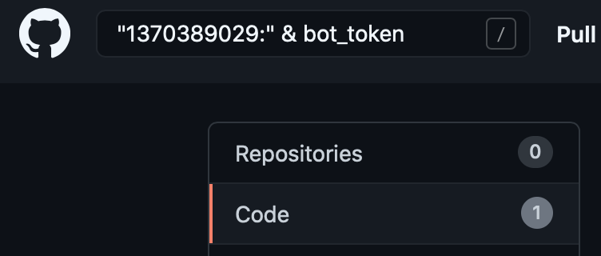
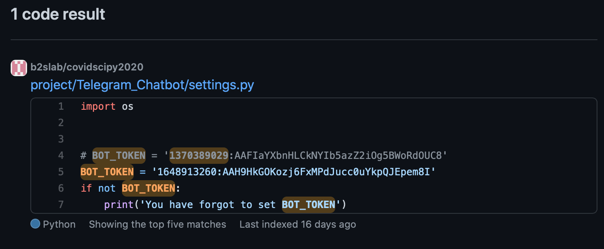
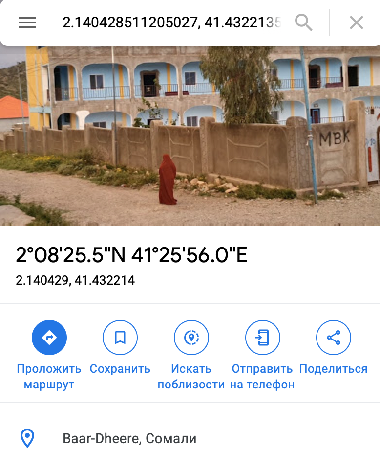
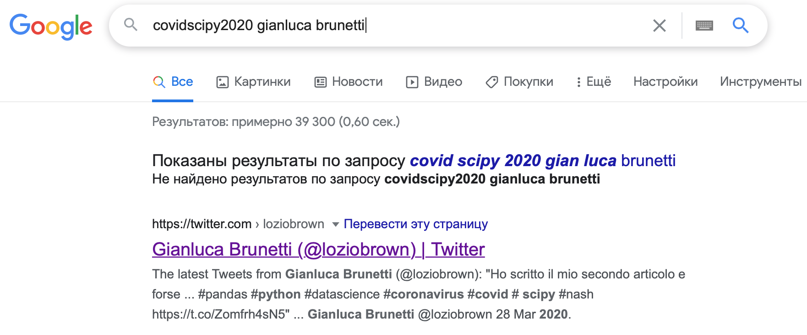
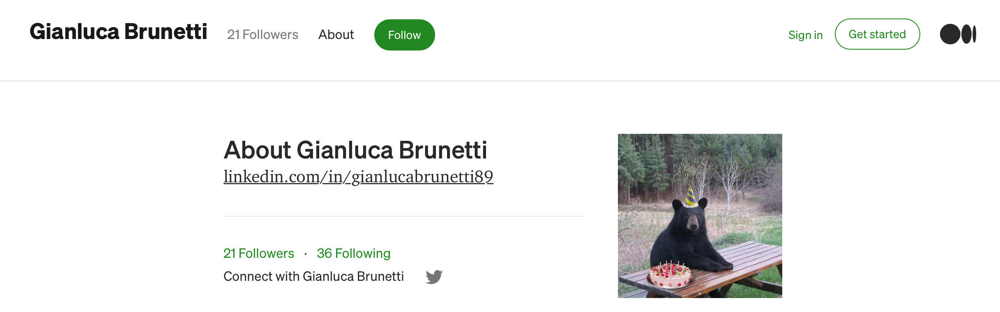

# Yet another bot
## Описание

Команда Group-IB ищет создателей одного телеграм-бота. Всё, что у нас есть - это его ID: 1370389029. Разведка доложила, что раньше ID был другим.
Нам надо узнать, какой был username старого бота. Помоги узнать, в каком городе был один из его создателей 03.11.2020 
около 9:40, и его username в LinkedIn?

Формат ответа: dubna{username_бота&Город&LinkedIn}

Автор: Panda

## Решение 

Итак, у нас есть только ID бота. Что же мы можем с ним сделать? Приведу ниже выданный хинт: 

> Токен Telegram-бота имеет следующий вид:
`bot_id:string`. Bot_id не является пользовательским идентификатором Telegram. Токен бота используется для общения с Telegram Bot API. Все запросы к Telegram Bot API должны происходить через HTTPS и должны быть представлены в следующей форме: 
`https://api.telegram.org/bot<token>/METHOD_NAME`.
Однако есть куча библиотек на разных языках, которые автоматизируют эти запросы. Разработчикам остается только предоставить библиотеке токен и написать программу с ее использованием. Как мы знаем, не все разработчики ПО осведомлены об элементарных правилах безопасности.

Много слов было сказано в Интернете о том, что разработчики не особо думают об безопасности данных, которые они оставляют на виду у всех в процессе разработки. После небольшого гуглинга можно было наткнуться на следующую статью: [LMGTFY:"telegram bot osint"](https://xakep.ru/2019/09/06/real-osint/#toc01).

После небольшого осознания ситуации идем на Github. 



Да, Github (и не только он) поддерживает некоторые свои операторы поиска! 

Далее нас ждет не менее удивительная [картина](https://github.com/b2slab/covidscipy2020/blob/3eea2a5d2c6fe2cc9ea55e53ab797c2ab5fc2271/project/Telegram_Chatbot/settings.py): 



Смекаете? Да, в задании было немного путающее описание. Бот с ID 1370389029 использщуется в проекте с пометкой LEGACY (!), как минимум это должно было вызвать вопросы. Часто ли данные разведки точны? 😉

Итак, у нас теперь дано: 

- токен нового бота `1648913260:AAH9HkGOKozj6FxMPdJucc0uYkpQJEpem8I`
- токен старого бота `1370389029:AAFIaYXbnHLCkNYIb5azZ2iOg5BWoRdOUC8`

Теперь мы можем узнать username старого бота при помощи простейшего бота в Telegram API (на всякий случай используем tor):

```
torify curl https://api.telegram.org/bot1370389029:AAFIaYXbnHLCkNYIb5azZ2iOg5BWoRdOUC8/getMe 

{
  "ok": true,
  "result": {
    "id": 1370389029,
    "is_bot": true,
    "first_name": "test_bot",
    "username": "dani15498_test_bot",
    "can_join_groups": true,
    "can_read_all_group_messages": false,
    "supports_inline_queries": false
  }
}
```

Отсюда следует, что username старого бота `dani15498_test_bot`.

Что же делать дальше? Абсолютно нормальным поведением было исследовать всех контрибьютеров проекта `covidscipy2020`. Верной (и самой простой) веткой решения было посмотреть, что же находится внутри этих самых ботов, у нас же все для этого есть! Любопытство - это залог успеха в  работе расследователя. "Как же это сделать?" - спросят наши маленькие читатели. "Очень просто!" - отвечу я. У хинта было двойное дно. 

> "Однако есть куча библиотек на разных языках, которые автоматизируют эти запросы. Разработчикам остается только предоставить библиотеке токен".

Если, конечно, вам очень хотелось, то вы могли написать свой дампер ботов Telegram, но зачем? Есть несколько готовых утилит, которые легко справляются с этой задачей. Для примера будем использовать [telegram-bot-dumper](https://github.com/soxoj/telegram-bot-dumper).

```
$ ./dumper.py --token 1370389029:AAFIaYXbnHLCkNYIb5azZ2iOg5BWoRdOUC8 --tor

$ ./dumper.py --token 1648913260:AAH9HkGOKozj6FxMPdJucc0uYkpQJEpem8I --tor
```

У нас теперь есть полная переписка данных ботов с людьми. Судя по ней, боты являются аналогом друг друга, однако есть несколько различающихся деталей. Покопавшись в логах можно было найти сообщения с геопозицией пользователей, причем везде примерно одинаковой. Соотнеся их с данными  датой и временем, возмем следующую строчку из логов: 

```
[1078][1390422366][2020-11-03 09:44:44+00:00] Geoposition: 2.140428511205027, 41.432213587374356
```

Загуглим координаты и получим город `Baar-Dheere`. 




Что ж, осталось найти LinkedIn создателя с Telegram ID `1390422366`. К слову, из тех же логов бота (любого) можно взять его полное имя: `Gianluca Brunetti`.

Дальше предполагался не очень тривиальный шаг. Так как имя является распространенным, попытаемся объединить имеющуюся у нас информацию и просто погуглить. 



Таким образом, найдем [следующий](https://twitter.com/loziobrown/status/1243865999331524608)  пост в Twitter.


Осталось совсем чуть-чуть (честно). Зайдем на [страницу](https://medium.com/@loziobrown) автора [поста](https://medium.com/@loziobrown/lavvocato-conte-ovvero-come-ho-imparato-a-non-preoccuparmi-e-ad-amare-il-decreto-7a930adc2863) на Medium.



Видим последнюю часть флага: `gianlucabrunetti89`. 


## Флаг


`dubna{dani15498_test_bot&Baar-Dheere&gianlucabrunetti89}`

`dubna{dani15498_test_bot&Baardheere&gianlucabrunetti89}`


