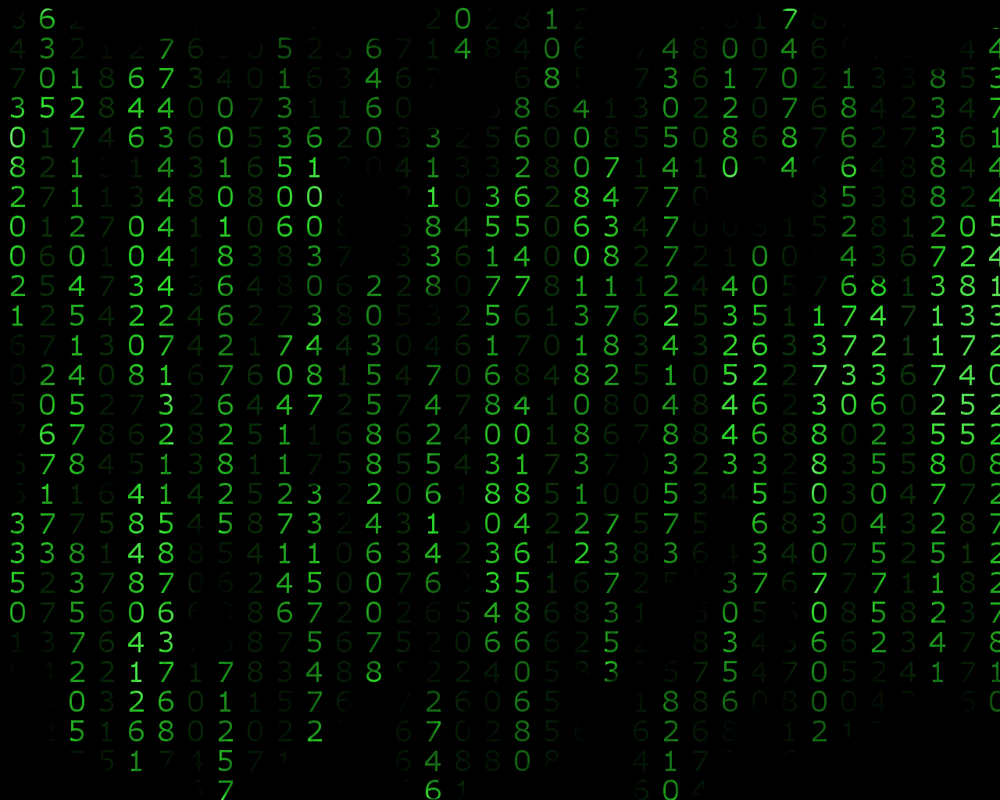
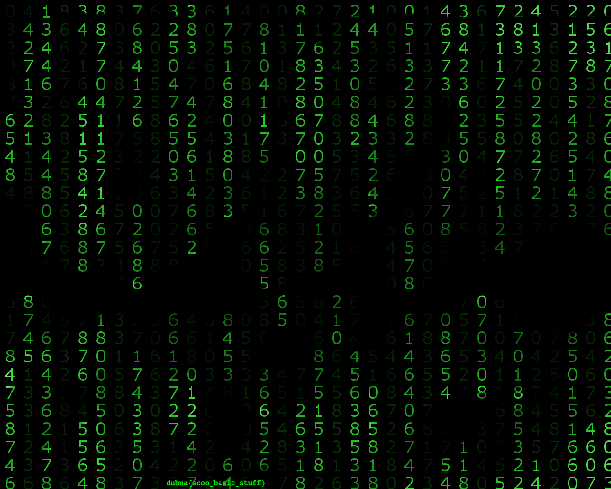

# NEO
## Описание

Ребята из Департамента расследований высокотехнологичных преступлений Group-IB уверены, что этот Нео что-то скрывает. А что думаешь ты?

Автор: Panda

## Решение 

Итак, начнем стандартную процедуру исследования стегоконтейнера с утилиты `binwalk`.

```
$ binwalk  -e neo.tiff

DECIMAL       HEXADECIMAL     DESCRIPTION
--------------------------------------------------------------------------------
0             0x0             TIFF image data, little-endian offset of first image directory: 1438830
1439188       0x15F5D4        Zip archive data, at least v2.0 to extract, compressed size: 3968553, uncompressed size: 3997895, name: NvL-2.gif
5407871       0x52847F        End of Zip archive, footer length: 22
```

У нас уже есть нечто интересное. Файл tiff оказался склеен с gif, помещенным в архив. 
Это некая каламбурная версия [RarJpeg](https://lurkmore.to/Rarjpeg) (Вообще, можно склеивать все со всем).
Все вытащенные файлы `binwalk` поместил в папку [_neo.tiff.extracted](./_neo.tiff.extracted). 
Там находим наш GIF файл: 2020




Заметили нечто странное?

Да, на одном из кадров появляется флаг. В MacOS автоматически открывается "каталог" кадров GIF изображения, в других платформах вы можете воспользоваться утилитой `ffmpeg` и вытащить все кадры. 

```
mkdir temp
ffmpeg -i _neo.tiff.extracted/NvL-2.gif -vsync 0 temp/temp%d.png
```

Вот кадр с флагом: 



## Флаг 

`dubna{sooo_basic_stuff}`
