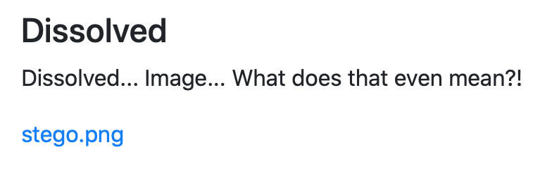
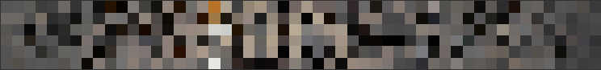
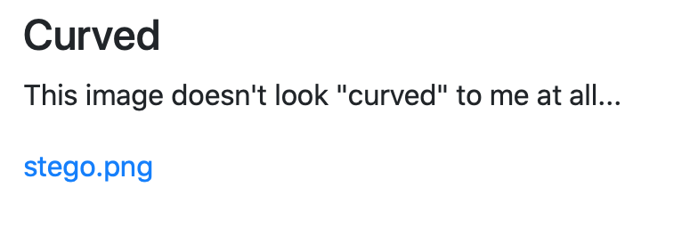
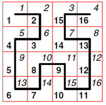
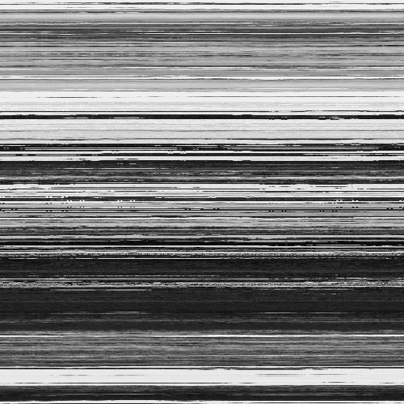
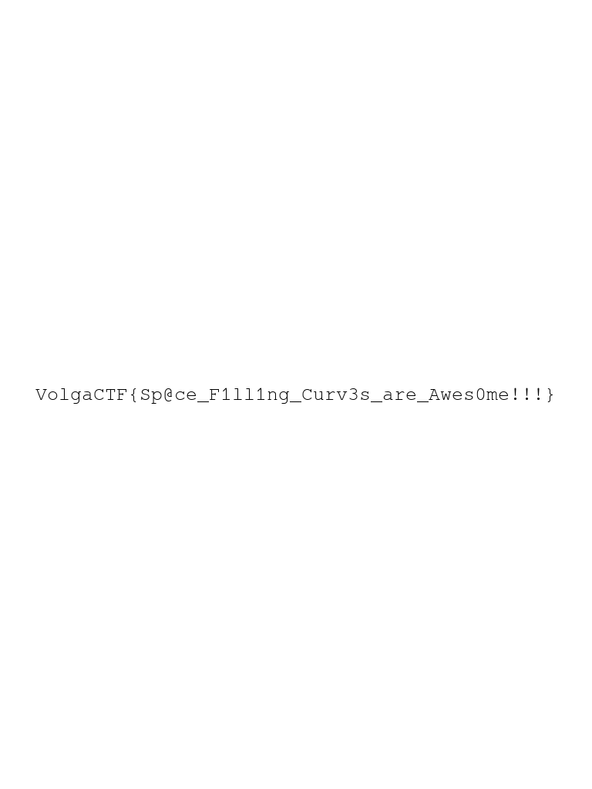
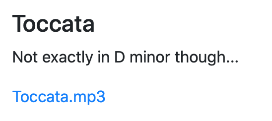

# Dissolved 



[stego.png](./src/stego.png)

Пойдем по стандартному алгоритму решения тасок на стеганку (exiftool + zsteg + binwalk + stegsolve).

```bash
$  exiftool stego.png   
ExifTool Version Number         : 11.06
File Name                       : stego.png
Directory                       : .
File Size                       : 1866 kB
File Modification Date/Time     : 2020:03:27 19:47:24+03:00
File Access Date/Time           : 2020:03:28 13:34:42+03:00
File Inode Change Date/Time     : 2020:04:03 10:51:15+03:00
File Permissions                : rw-r--r--
File Type                       : PNG
File Type Extension             : png
MIME Type                       : image/png
Image Width                     : 1280
Image Height                    : 1600
Bit Depth                       : 8
Color Type                      : RGB with Alpha
Compression                     : Deflate/Inflate
Filter                          : Adaptive
Interlace                       : Noninterlaced
Image Size                      : 1280x1600
Megapixels                      : 2.0


$ zsteg stego.png
imagedata           .. file: SVR2 pure executable (USS/370) not stripped - version 16646400
b1,rgba,lsb,xy      .. text: ["w" repeated 12 times]
b1,abgr,msb,xy      .. text: "wwwwwwwwwwwwy"
b2,b,lsb,xy         .. text: "UUUUUZUU?"
b2,rgba,lsb,xy      .. text: "???????CCC"
b2,abgr,msb,xy      .. text: ["k" repeated 11 times]
b3,abgr,msb,xy      .. file: PGP Secret Sub-key -
b4,r,lsb,xy         .. text: "wffffwfffUDDDDDDDDDDD$TE>"
b4,r,msb,xy         .. text: "\"\"\"\"\"\"\"\"\"\"\"$*"
b4,g,lsb,xy         .. text: "\"4DUUVVfwffwwwx"
b4,b,lsb,xy         .. text: "#3D3\"3334Dffgww"
b4,b,msb,xy         .. text: "Dfffffffff"


$ binwalk stego.png                                              

DECIMAL       HEXADECIMAL     DESCRIPTION
--------------------------------------------------------------------------------
0             0x0             PNG image, 1280 x 1600, 8-bit/color RGBA, non-interlaced
41            0x29            Zlib compressed data, best compression
```

На последнем этапе начинается самое интересное. В Stegsolve на Alpha plane 2 и Alpha plane 0 замечаем [вот такие вот](./src/solved.bmp) черные пиксели на белом фоне. Прошу заметить, что они одинаковые на обоих срезах. 
Проверяем: 

1. Черные пиксели действительно черные. 
2. На строчке находиться только один пиксель. 
3. Есть строчки без черных пикселей. 
4. Есть столбцы с несколькими черными пикселями. 

Строим несколько предположений: 

1. Эти пиксели составляют картинку. 
2. Эти пиксели участвую в карусели разных кодировок. 
3. Эти пиксели участвуют в Random LSB. 
4. Эти пиксели участвуют в каком-то <s>ебанистическом</s> кастомном алгоритме, о котором вы догадаетесь только через трое суток. 

Пункт 2. и 4. вы можете проверить сами или поверить на слово мне, что вы ничего умного там не найдете :)

Попробуем взять "отмеченные" пиксели с каналов RGB и собрать картинку. 

Кстати, пикселей всего 312. Довольно много, если предположить, что в одном пикселе зашифрован один сивол флага. 

Так вот, адекватным мне показалось разделить 312 пикселей на 6 в высоту и, соответственно, на 52 в длину. Результат ниже (увеличенный). 



В общем как ни крути получалась дичь. Самое время перейти к предположению номер 3. 

Возьмем всего лишь один LSB от каждого канала и О ЧУДО!

```python
from PIL import Image

img = Image.open("stego.png")
red, green, blue, alpha = img.split()
width, height = img.size

r_lsb = ''
g_lsb = ''
b_lsb = ''

alpha = alpha.load()
red = red.load()
green = green.load()
blue = blue.load()

for y in range(height):
    for x in range(width):
        if alpha[x, y] != 255:
            r_lsb += str(red[x, y] & 0x1)
            g_lsb += str(green[x, y] & 0x1)
            b_lsb += str(blue[x, y] & 0x1)
print(r_lsb)
print(g_lsb)
print(b_lsb) # ASCII: VolgaCTF{Tr@nspar3ncy_g1ves_fLag_aw@y!}
```

**Флаг:** `VolgaCTF{Tr@nspar3ncy_g1ves_fLag_aw@y!}`

# Curved



[stego.png](./src/stego1.png)

Стандарт. 

```bash
$ exiftool stego1.png                                             [12:13:08]
ExifTool Version Number         : 11.06
File Name                       : stego1.png
Directory                       : .
File Size                       : 255 kB
File Modification Date/Time     : 2020:03:27 21:52:45+03:00
File Access Date/Time           : 2020:03:28 16:16:34+03:00
File Inode Change Date/Time     : 2020:04:03 11:56:00+03:00
File Permissions                : rw-r--r--
File Type                       : PNG
File Type Extension             : png
MIME Type                       : image/png
Image Width                     : 512
Image Height                    : 512
Bit Depth                       : 8
Color Type                      : RGB
Compression                     : Deflate/Inflate
Filter                          : Adaptive
Interlace                       : Noninterlaced
Image Size                      : 512x512
Megapixels                      : 0.262

$  zsteg stego1.png                                           [12:13:52]127 ↵
imagedata           .. text: ["\n" repeated 9 times]
b2,b,msb,xy         .. text: "]WUUuUUU]UUUU]UUUwUUUUUU"
b2,rgb,msb,xy       .. file: MPEG ADTS, layer I, v2, 112 kbps, Monaural
b3,r,msb,xy         .. text: "9[\t' ;R~\\i"
b3,bgr,msb,xy       .. file: MPEG ADTS, layer I, v2, 256 kbps, Monaural
b4,b,msb,xy         .. text: ["w" repeated 9 times]
b4,rgb,msb,xy       .. file: ddis/ddif

$  binwalk stego1.png

DECIMAL       HEXADECIMAL     DESCRIPTION
--------------------------------------------------------------------------------
0             0x0             PNG image, 512 x 512, 8-bit/color RGB, non-interlaced
41            0x29            Zlib compressed data, best compression
```

Из стегсолва нам максимум может быть интересен [Blue plane 0](./src/solved1.bmp) и [Gray bits](./src/solved2.bmp). Но ничего известного они нам не напоминают, поэтому it's time to google. 

Оказывается, что  дядьки на картинке это Джузеппе Пеано и Давид Гильберт. А из общего у них, помимо проффесии, кривая (Curve по-английски, смекаете?!) Выглядит она вотак:


Самые смекалистые уже поняли, в чем дело. Но давайте не будем торопить события, прогуглм еще вот что: `hilbert curve stego`.

Натыкаемся на несколько работ, описывающих непосредственно алгоритм сокрытия и сопутствующую аналитику ([тык](https://www.researchgate.net/publication/257147057_Visual_Cryptography_and_Image_Steganography_Using_Space_Filling_Hilbert_Curves) и [тык](http://vnsgu.ac.in/dept/publication/vnsgujst41july2015/2.pdf)). 

Собственно алгоритм таков: 

1. Строим кривую Гильберта поверх данного нас изображения таким образом, чтобы следуя вдоль этой кривой мы получили последовательность пикселей. Для тех, кто все еще не понял, оставляю картинку на размышление: 



2. Проходим по кривой и собираем LSB пикселей. Какие? В этом нам еще стоит разобраться. 

Не буду вас мучить техникой построения этой самой кривой. В интернетиках есть все, поэтому берем первый попавшийся код. Самая бльшая сложноть возникает в подборе итераций. Сразу скажу, что их 9. Это решается подбором. Для дальнейшего упрощения просто создадим новое изображение с пикселями в новом порядке. 

```python
import numpy as np
import cv2
# dictionary containing the first order hilbert curves
base_shape = {'u': [np.array([0, 1]), np.array([1, 0]), np.array([0, -1])],
              'd': [np.array([0, -1]), np.array([-1, 0]), np.array([0, 1])],
              'r': [np.array([1, 0]), np.array([0, 1]), np.array([-1, 0])],
              'l': [np.array([-1, 0]), np.array([0, -1]), np.array([1, 0])]}
 
 
def hilbert_curve(order, orientation):
    """
    Recursively creates the structure for a hilbert curve of given order
    """
    if order > 1:
        if orientation == 'u':
            return hilbert_curve(order - 1, 'r') + [np.array([0, 1])] + \
                   hilbert_curve(order - 1, 'u') + [np.array([1, 0])] + \
                   hilbert_curve(order - 1, 'u') + [np.array([0, -1])] + \
                   hilbert_curve(order - 1, 'l')
        elif orientation == 'd':
            return hilbert_curve(order - 1, 'l') + [np.array([0, -1])] + \
                   hilbert_curve(order - 1, 'd') + [np.array([-1, 0])] + \
                   hilbert_curve(order - 1, 'd') + [np.array([0, 1])] + \
                   hilbert_curve(order - 1, 'r')
        elif orientation == 'r':
            return hilbert_curve(order - 1, 'u') + [np.array([1, 0])] + \
                   hilbert_curve(order - 1, 'r') + [np.array([0, 1])] + \
                   hilbert_curve(order - 1, 'r') + [np.array([-1, 0])] + \
                   hilbert_curve(order - 1, 'd')
        else:
            return hilbert_curve(order - 1, 'd') + [np.array([-1, 0])] + \
                   hilbert_curve(order - 1, 'l') + [np.array([0, -1])] + \
                   hilbert_curve(order - 1, 'l') + [np.array([1, 0])] + \
                   hilbert_curve(order - 1, 'u')
    else:
        return base_shape[orientation]
 

if __name__ == '__main__':
    order = 9
    curve = hilbert_curve(order, 'u')
    curve = np.array(curve)
    cur_coord = (0,0)
    im = cv2.imread("stego1.png")

    new_im = np.zeros([512,512,3], dtype=np.uint8)
    x = []

    for item in curve:
        x.append(im[cur_coord[0]][cur_coord[1]])
        cur_coord = (cur_coord[0] + item[0], cur_coord[1] + item[1])
    x.append(im[cur_coord[0]][cur_coord[1]])

    c = 0
    for i in range(new_im.shape[0]):
        for j in range(new_im.shape[1]):
            new_im[i][j] = x[c]
            c+=1

    cv2.imwrite('new_im2.png', cv2.cvtColor(new_im, cv2.COLOR_RGB2BGR))  
```


Заглянем в это изображение через призму Stegsolve. В серых битах недвузначный [намек](./src/solved3.bmp). 

А самое главное: 

```bash 
$ zsteg new_im2.png                                               [12:59:50]
imagedata           .. text: "A??\t\n\nEDD"
b1,r,lsb,xy         .. file: PNG image data, 768 x 1024, 8-bit/color RGBA, non-interlaced
b2,r,lsb,xy         .. text: "QP*ZN%Ei"
b2,r,msb,xy         .. text: "wUwUUUUUUU"
b2,g,lsb,xy         .. text: "YUUnZ\neQm"
b2,bgr,msb,xy       .. file: MPEG ADTS, layer I, v2, 112 kbps, Monaural
b3,rgb,msb,xy       .. file: MPEG ADTS, layer I, v2, 256 kbps, Monaural
b4,r,msb,xy         .. text: ["w" repeated 14 times]
b4,bgr,msb,xy       .. file: ddis/ddif
```

В красном LSB видим изображение. Извлечем его. 

```bash
$ zsteg -E "b1,r,lsb,xy" new_im2.png > result.png
```


**Флаг:** `VolgaCTF{Sp@ce_F1ll1ng_Curv3s_are_Awes0me!!!}`

# Toccata 




[toccata.mp3](./src/toccata.mp3)
