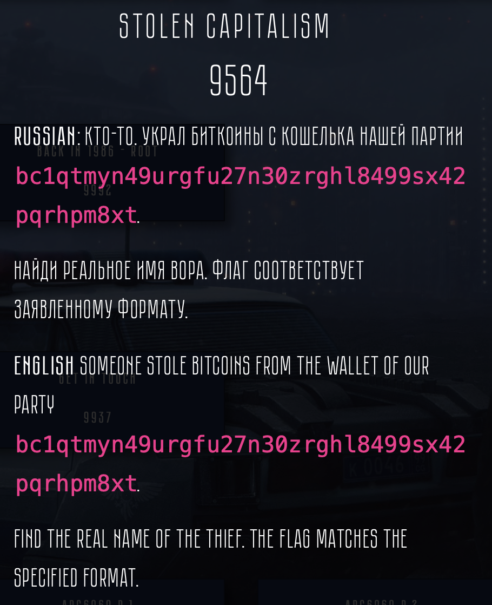
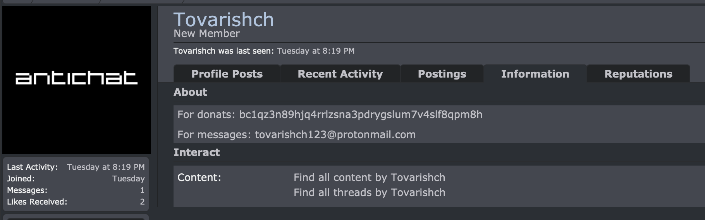
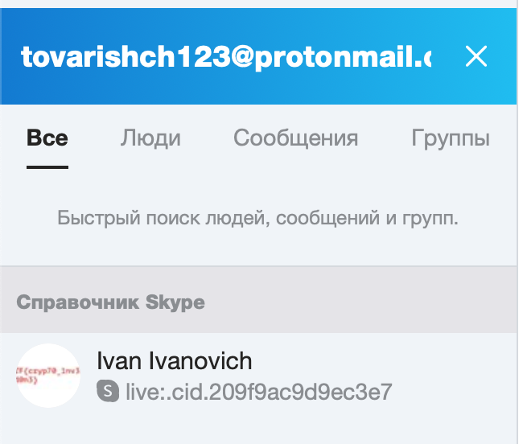
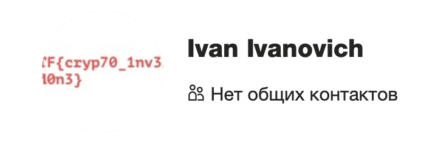
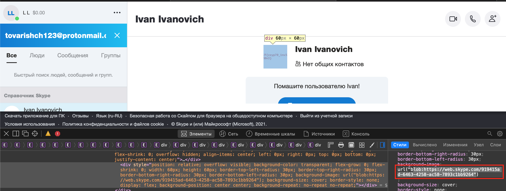
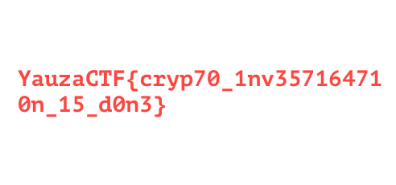
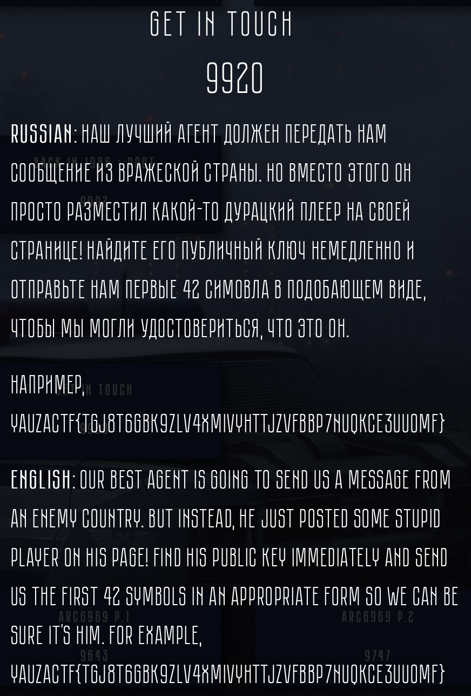
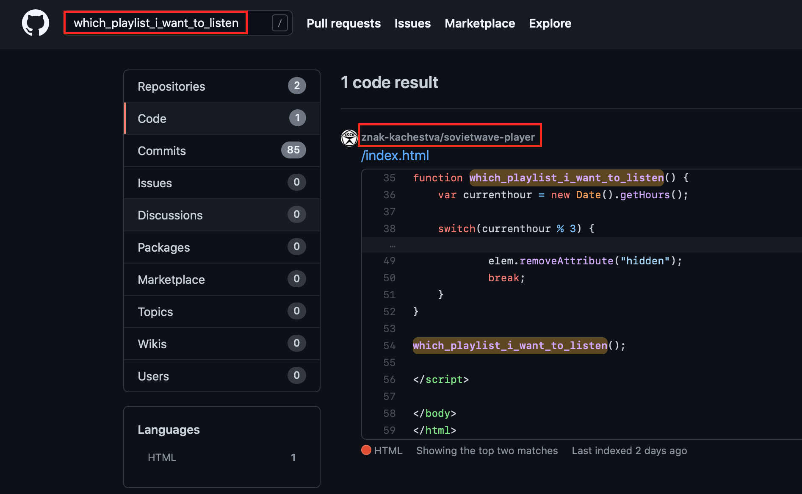
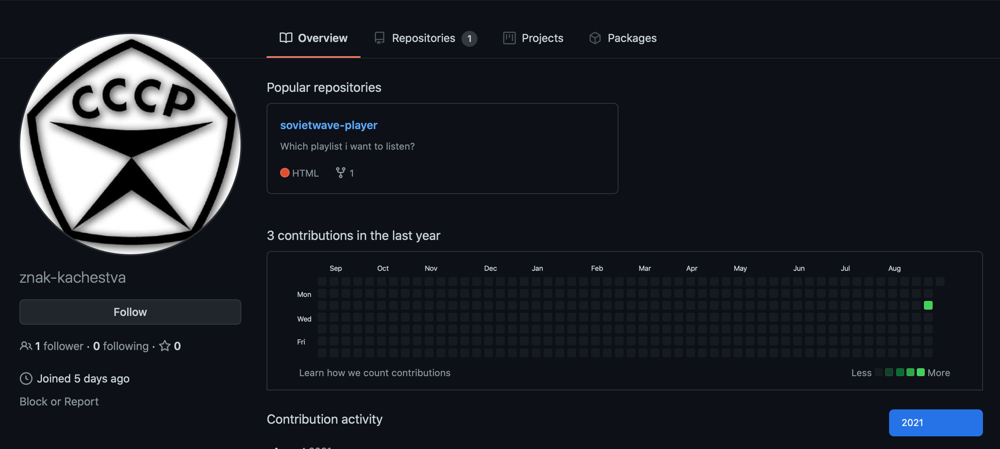
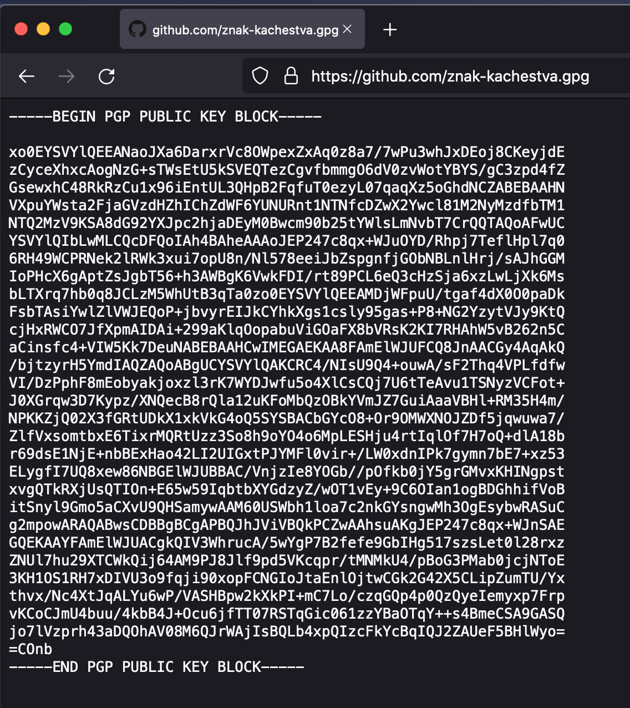

# Stolen Capitalism 



You should follow the movement of cryptocurrency up to the final station.
Tools can be any, for example blockchair.com. 
Transactions:

- `05e3d1eaec7d263e80d4cc03958bf9c0136888a1acd99661cba7dd86fe36d44b`
- `ffd62738050b5f2668760ef202db6894b6f9659e04a6ece508cab36fd2edd6dc`
- `7a746df9eb9974e8e5821fbaea0f141859fbb1533d6dec92bd2f7aaaad00b9dd`

The next step is to identificate the owner of the last wallets.
Let's just google. For the wallet `bc1qz3n89hjq4rrlzsna3pdrygslum7v4slf8qpm8h` we recieve 1 interesting result in Google leading to page with russhian underground forum: https://antichat.com/members/413903/

The vectors are following:
1. Messages on forum 
2. Contact details in Information tab
3. Nickname

Messages on forum are useless. There are nothing interesting on social media by nickname "Tovarishch".

After examination of this profile we can conclude that the perspective vector is tovarishch123@protonmail.com. 



For Proton mail we can find several things:
1. PGP key 
2. New nickname
3. Data disclosure by functionality of password recovery
4. finding accounts on this email.

There is a little probability to find thief's name  by 1 or 3 unlike new accounts by email. You can try to use account finders like telegram-bots (not true osinter) or try it manually (true osinter).




The next step is to extract the profile photo with the flag. It is needed to find neccessary element and copy the url (blob:https://web.skype.com/919415ad-6463-4258-ac58-7893c1bb9264) to browser.




**Flag**: `YuazaCTF{cryp70_1nv357164710n_15_d0n3}`

# Get in touch 



The attachment to task is simple page, hosting by organizators.

```html
<!DOCTYPE html>
<html>
<body style="background-color: red;">
    <link rel="stylesheet" href="https://cdn.plyr.io/3.6.8/plyr.css" />
    <script src="https://cdn.plyr.io/3.6.8/plyr.polyfilled.js"></script>

<div hidden class="plyr__video-embed" id="player1">
    <iframe
        src="https://www.youtube.com/embed/DMoCM_FgLP8"
        allowfullscreen
        allowtransparency
        allow="autoplay"
    ></iframe>
</div>

<div hidden class="plyr__video-embed" id="player2">
    <iframe
        src="https://www.youtube.com/embed/Bwf9f498Yqs"
        allowfullscreen
        allowtransparency
        allow="autoplay"
    ></iframe>
</div>

<div hidden class="plyr__video-embed" id="player3">
    <iframe
        src="https://www.youtube.com/embed/o2mD5hv0eMc"
        allowfullscreen
        allowtransparency
        allow="autoplay"
    ></iframe>
</div>

<script>
function which_playlist_i_want_to_listen() {
    var currenthour = new Date().getHours(); 

    switch(currenthour % 3) {
        case 0:
            var elem = document.getElementById("player1");
            elem.removeAttribute("hidden");
            break;
        case 1:
            var elem = document.getElementById("player2");
            elem.removeAttribute("hidden");
            break;
        case 2:
            var elem = document.getElementById("player3");
            elem.removeAttribute("hidden");
            break;
    }
}

which_playlist_i_want_to_listen();

</script>

</body>
</html>
```

We can notice two things.
1. Youtube videos (random, nothing in common)
2. Strange function `which_playlist_i_want_to_listen`

This long unlogic name should be unique in repositories scope, shouldn't it?
The most famous is GitHub, GitLab and Bitbucket. 
Trying to find the author of this code we can get this:



The profile of developer: https://github.com/znak-kachestva



To get public key as it says in the task we should just add `.keys` (SSH) or `.gpg` (GPG) to the profile link. 

- https://github.com/znak-kachestva.keys

- https://github.com/znak-kachestva.gpg

The first link is empty, but another one contain the PGP key. 



The flag is first 42 symbols of that (till slash).

**Flag**: `YauzaCTF{xo0EYSVYlQEEANaoJXa6DarxrVc8OWpexZxAq0z8a7}`