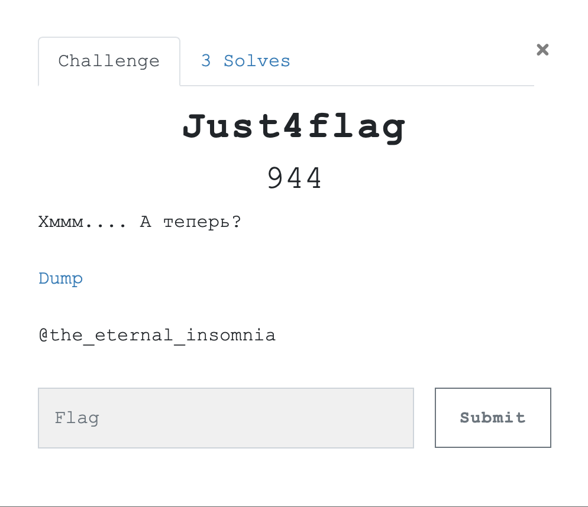
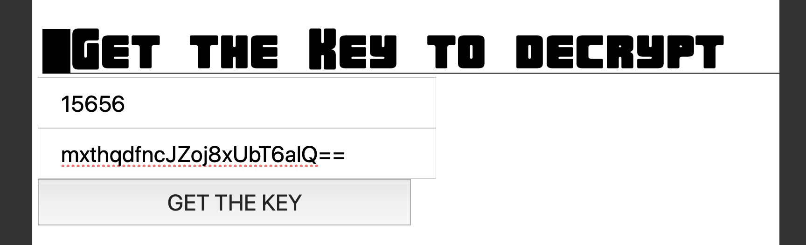
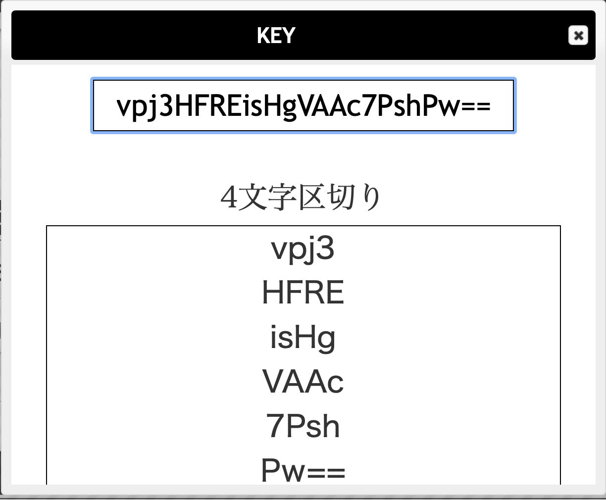
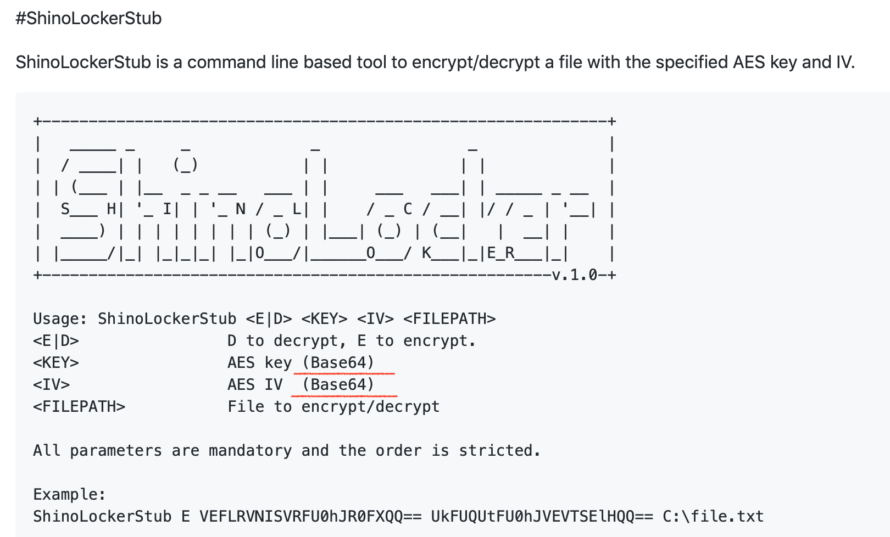
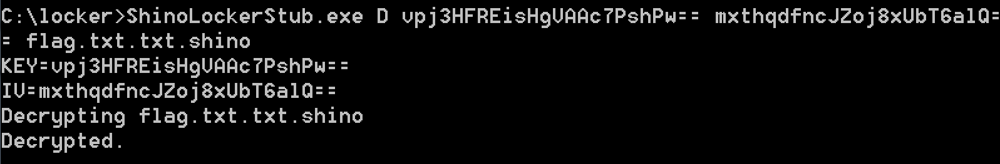

# Just4flag 

## Дисклеймер 

У just4flag был злой брат-близнец, который отличался флагом и решался просто через стринги. Извините. 



[Dump](https://yadi.sk/d/_vaWjwzzrL9D-Q)

Нам нужно разобраться, что же произошло. Приведу здесь только шаги, приводящие к решению.  

```
$ python vol.py -f ../dump.raw --profile=Win7SP1x64 pstree
Volatility Foundation Volatility Framework 2.6

Name                                                  Pid   PPid   Thds   Hnds Time
-------------------------------------------------- ------ ------ ------ ------ ----
 0xfffffa8000ca8750:wininit.exe                       348    296      3     76 2019-05-09 20:54:03 UTC+0000
 . . .
 0xfffffa80028e8b10:explorer.exe                     2404   2400     43   1120 2019-05-09 21:20:25 UTC+0000
. 0xfffffa8000f49b10:ShinoLocker.ex                  3976   2404     12    451 2019-05-09 21:57:27 UTC+0000
.. 0xfffffa80016c9060:chrome.exe                     3240   3976     30    798 2019-05-09 21:58:14 UTC+0000
... 0xfffffa8001e315d0:chrome.exe                    3672   3240      7     90 2019-05-09 21:58:14 UTC+0000
... 0xfffffa80018ad060:chrome.exe                    3828   3240     11    208 2019-05-09 21:58:18 UTC+0000
... 0xfffffa80015063e0:chrome.exe                    2588   3240      8    194 2019-05-09 21:58:14 UTC+0000
... 0xfffffa8000eea880:chrome.exe                     312   3240     11    208 2019-05-09 21:58:18 UTC+0000
... 0xfffffa8001c65850:chrome.exe                    2748   3240     12    233 2019-05-09 21:58:14 UTC+0000
... 0xfffffa8000fec1a0:chrome.exe                    2936   3240     13    310 2019-05-09 21:58:14 UTC+0000
... 0xfffffa8001e4db10:chrome.exe                    2812   3240      2     60 2019-05-09 21:58:14 UTC+0000
... 0xfffffa8001ca0a50:chrome.exe                    2968   3240     11    206 2019-05-09 21:58:19 UTC+0000
. 0xfffffa8001cebb10:regsvr32.exe                    2356   2404      0 ------ 2019-05-09 21:20:36 UTC+0000
. 0xfffffa800263db10:notepad.exe                     2104   2404     11    414 2019-05-09 21:58:56 UTC+0000
. 0xfffffa8001ea8250:DumpIt.exe                      3172   2404      2     46 2019-05-09 21:59:34 UTC+0000
 0xfffffa8001eff980:winlogon.exe                      376    332      7    135 2019-05-09 20:54:03 UTC+0000
 0xfffffa8000ca5b10:csrss.exe                         340    332     11    471 2019-05-09 20:54:03 UTC+0000
. 0xfffffa80017d0900:conhost.exe                     1056    340      2     53 2019-05-09 21:59:34 UTC+0000
```

Наиболее интересны процессы с pid  3976,  3240, 2104.
Начнем с истории посещений в chrome.

```
$ python vol.py --plugins=../volatility-plugins/ -f ../dump.raw --profile=Win7SP1x64 chromehistory
Index  URL                                                                              Title                                                                            Visits Typed Last Visit Time            Hidden Favicon ID
------ -------------------------------------------------------------------------------- -------------------------------------------------------------------------------- ------ ----- -------------------------- ------ ----------
     8 https://shinolocker.com/?h=15676&t=Y2o0xT4MzN7Rfarr7hgWYQ%3D%3D#key              ShinoLocker -The Ransomware Simulator-                                                1     0 2019-05-09 21:58:17.187981        N/A    
```

Запоминаем ссылочку. 
Просканим память на файлы.

```
$ python vol.py -f ../dump.raw --profile=Win7SP1x64 filescan | grep -E "Desktop|Shino"
Volatility Foundation Volatility Framework 2.6
0x000000003e07b2e0      2      0 R--rwd \Device\HarddiskVolume2\Users\Public\Desktop\OVGorskiy.ru.url
0x000000003e14a2e0      2      0 R--rwd \Device\HarddiskVolume2\Users\Public\Desktop\OVGorskiy.ru.url
0x000000003e32ce20      2      0 R--rwd \Device\HarddiskVolume2\ProgramData\Microsoft\Windows\Start Menu\Programs\Accessories\Desktop.ini
0x000000003e47f680     16      0 R--rwd \Device\HarddiskVolume2\ProgramData\Microsoft\Windows\Start Menu\Programs\Accessories\Remote Desktop Connection.lnk
0x000000003e4dcf20     16      0 RW-rwd \Device\HarddiskVolume2\Users\Kik\Desktop\ShinoLocker.exexe
0x000000003e70ef20      2      0 R--rwd \Device\HarddiskVolume2\ProgramData\Microsoft\Windows\Start Menu\Programs\Accessories\Accessibility\Desktop.ini
0x000000003ec16450      1      1 R--rw- \Device\HarddiskVolume2\Users\Kik\Desktop
0x000000003ec1d9e0     16      0 R--rwd \Device\HarddiskVolume2\Users\Kik\Links\Desktop.lnk
0x000000003ec27240     16      0 R--rwd \Device\HarddiskVolume2\Users\Kik\Desktop\desktop.ini
0x000000003ec63f20     16      0 R--r-- \Device\HarddiskVolume2\Users\Kik\Desktop\flag.txt.txt
0x000000003ecc4e40      2      1 R--rwd \Device\HarddiskVolume2\Users\Kik\Desktop
0x000000003ee13b60      2      1 R--rwd \Device\HarddiskVolume2\Users\Public\Desktop
0x000000003ee61e00     16      0 R--rwd \Device\HarddiskVolume2\Users\Kik\AppData\Roaming\Microsoft\Windows\SendTo\Desktop.ini
0x000000003ef5d850      2      0 R--rwd \Device\HarddiskVolume2\Users\Kik\AppData\Roaming\Microsoft\Windows\Start Menu\Programs\Accessories\System Tools\Desktop.ini
0x000000003efa2200      2      0 R--rwd \Device\HarddiskVolume2\Users\Kik\AppData\Roaming\Microsoft\Windows\Start Menu\Programs\Accessories\Desktop.ini
0x000000003efc9f20      1      1 R--rw- \Device\HarddiskVolume2\Users\Kik\Desktop
0x000000003f2dc070      2      1 R--rwd \Device\HarddiskVolume2\Users\Kik\Desktop
0x000000003f387390      2      0 R--rwd \Device\HarddiskVolume2\Users\Kik\AppData\Roaming\Microsoft\Windows\Start Menu\Programs\Maintenance\Desktop.ini
0x000000003f45d490      2      0 R--rwd \Device\HarddiskVolume2\ProgramData\Microsoft\Windows\Start Menu\Programs\Maintenance\Desktop.ini
0x000000003f47dc50      4      0 R--r-d \Device\HarddiskVolume2\Users\Kik\Desktop\ShinoLocker.exexe
0x000000003f4e96b0      2      0 R--rwd \Device\HarddiskVolume2\Users\Kik\AppData\Roaming\Microsoft\Windows\Start Menu\Programs\Accessories\Accessibility\Desktop.ini
0x000000003f57e070     16      0 R--rwd \Device\HarddiskVolume2\Users\Public\Desktop\Google Chrome.lnk
0x000000003f639bc0     16      0 R--rwd \Device\HarddiskVolume2\Users\Public\Desktop\desktop.ini
0x000000003f7af610     16      0 -W-r-- \Device\HarddiskVolume2\Users\Kik\Desktop\flag.txt.txt.shino
0x000000003fd202d0      2      0 R--rwd \Device\HarddiskVolume2\ProgramData\Microsoft\Windows\Start Menu\Programs\Games\Desktop.ini
0x000000003fdee070     16      0 R--rwd \Device\HarddiskVolume2\Users\Public\Desktop\Activators.lnk
0x000000003feb3cc0      2      0 R--rwd \Device\HarddiskVolume2\ProgramData\Microsoft\Windows\Start Menu\Programs\Accessories\System Tools\Desktop.ini
0x000000003ff699e0      2      1 R--rwd \Device\HarddiskVolume2\Users\Public\Desktop
```

Самое интересное, конечно же, файлики `flag.txt.txt.shino` и `flag.txt.txt`. Сдампим их и заодно `ShinoLocker.exe`.

```
$ python vol.py -f ../dump.raw --profile=Win7SP1x64 dumpfiles -D ../output/ -Q 0x000000003f47dc50
Volatility Foundation Volatility Framework 2.6
ImageSectionObject 0x3f47dc50   None   \Device\HarddiskVolume2\Users\Kik\Desktop\ShinoLocker.exexe
DataSectionObject 0x3f47dc50   None   \Device\HarddiskVolume2\Users\Kik\Desktop\ShinoLocker.exexe
```

```
$ python vol.py -f ../dump.raw --profile=Win7SP1x64 dumpfiles -D ../output/ -Q 0x000000003ec63f20
Volatility Foundation Volatility Framework 2.6
DataSectionObject 0x3ec63f20   None   \Device\HarddiskVolume2\Users\Kik\Desktop\flag.txt.txt
```

```
$ python vol.py -f ../dump.raw --profile=Win7SP1x64 dumpfiles -D ../output/ -Q 0x000000003f7af610 
Volatility Foundation Volatility Framework 2.6
DataSectionObject 0x3f7af610   None   \Device\HarddiskVolume2\Users\Kik\Desktop\flag.txt.txt.shino
```
Посмотрим, что тут у нас.

```
$ cat flag.txt.txt
qqqqqqqqqqqqqqqqqqqqqqqqqqqq
$ cat flag.txt.txt.shino
A?{?????4[???\??m?}???_(/?B
$ file Shinolocker.exe 
Shinolocker.exe: PE32 executable (GUI) Intel 80386 Mono/.Net assembly, for MS Windows
```

Отставить реверсить. Посмотрим на ссылку. Знакомьтесь: ShinoLocker, ransomware simulator. Смотрим видосик, как работает. Выдвигаем предположение, что flag.txt.txt.shino зашифрован AES128 EBC, так как нет инициализирующего вектора. А он есть. Получаем ключик чуть ниже. 

**(ключи в дампе другие)**





Минуту радуемся, минуту осознаем, что не EBC, гуглим название зверюшки и попадаем [сюда](https://github.com/Sh1n0g1/ShinoLocker/tree/master/ShinoLockerStub). 



Вам мне кажется, что TransactionId (второе поле в формочке сверху) напоминает IV? Проверяем:



**Флаг:** `YauzaCTF{50rry_f0r_7h15_bu6}`
