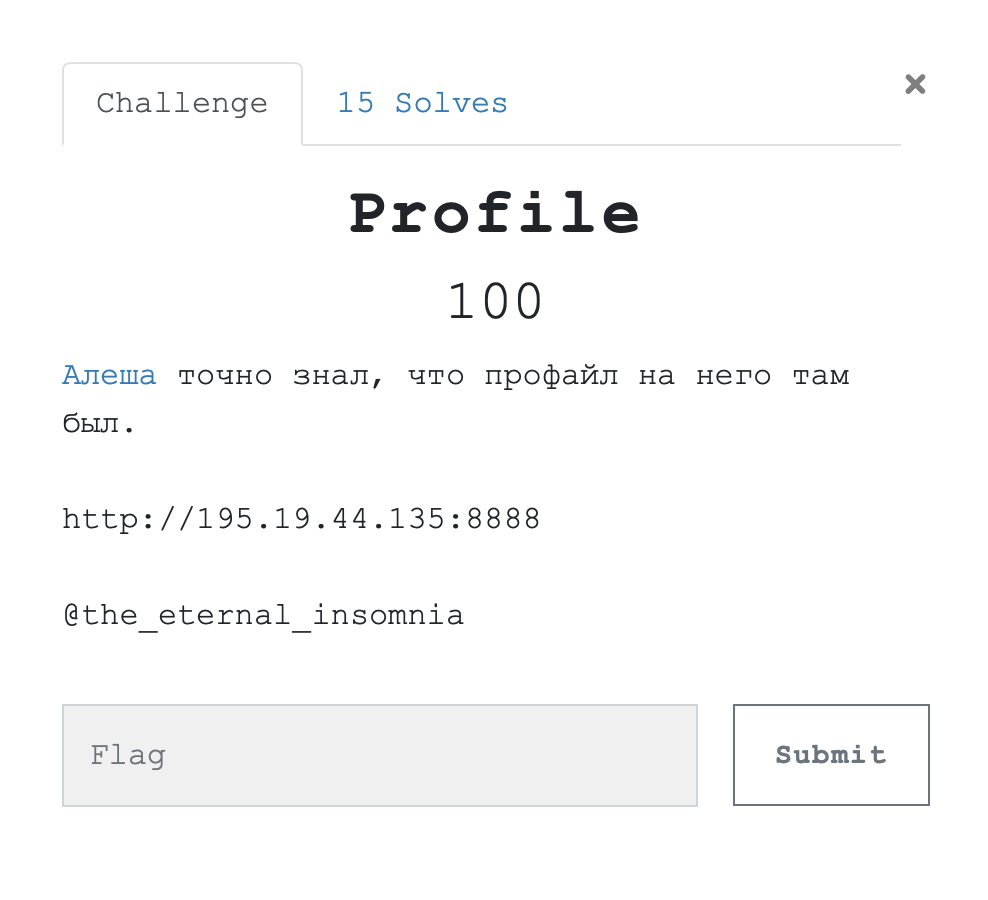
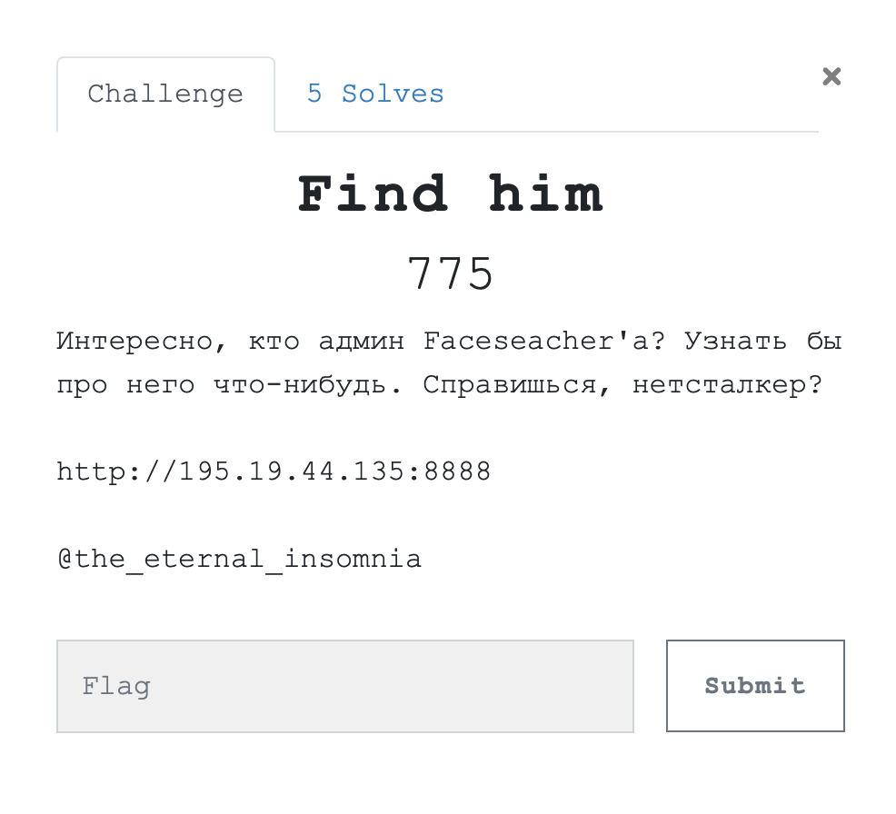
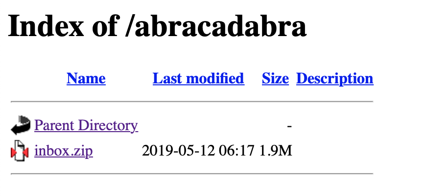
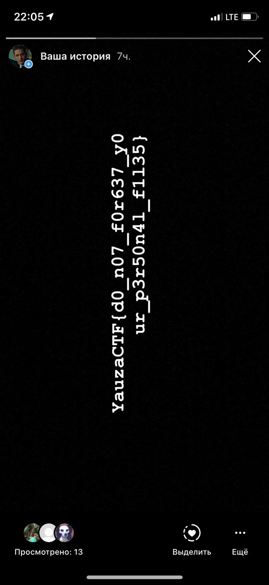

# Profile 



Нам дано две ссылки:

1. https://vk.com/farcerel_alex
2. http://195.19.44.135:8888

Изучив немного №2 и поняв, что поисковая строка ничего не дает, мы начинаем обращать внимание на профайлы ниже. Под каждой фотографией находится ссылка вида 
`http://195.19.44.135:8888/docs/md5(Имя Персонажа).pdf`

Из информации, данной в №1, формируем новую ссылку:

```
http://195.19.44.135:8888/docs/7503d3729495a39fd812fbff5b14b41f.pdf
```

где md5(Alex Gilan) = 7503d3729495a39fd812fbff5b14b41f

Переходим и забираем флаг. 

Чтиво для тех, кто хочет посмотреть на более сложный кейс: [тыц](https://zlonov.ru/security/hack-the-gartner-via-address-ba/)

**Флаг:** `YauzaCTF{url_c4n_54y_4_l07}`

# Find him 



Снова тот же сайт. Изучив его немного в первом таске и продолжив его изучать его в этом, рано или поздно можно нарваться на `http://195.19.44.135:8888/robots.txt` со следующим содержанием:

```
User-agent: *
Disallow: /abracadabra/
Allow: /
```
Переходим по `http://195.19.44.135:8888/abracadabra/`, видим индекс: 



Архив `index.zip` запаролен.

Брутим JohnTheRipper'ом.

```
$ zip2john inbox.zip > zip.hashes
ver 14  efh 5455  efh 7875  inbox.zip->notes.txt PKZIP Encr: 2b chk, TS_chk, cmplen=1061, decmplen=2452, crc=C8C6D417
ver 14  efh 5455  efh 7875  inbox.zip->gilan.png PKZIP Encr: 2b chk, TS_chk, cmplen=1937540, decmplen=1940140, crc=B4750AFB
ver 14  efh 5455  efh 7875  inbox.zip->post_final.pdf PKZIP Encr: 2b chk, TS_chk, cmplen=37612, decmplen=39253, crc=B4FE30F2
```

```
$ john zip.hashes 
Loaded 1 password hash (PKZIP [32/64])
No password hashes left to crack (see FAQ)
```

```
$ john zip.hashes --show
inbox.zip:iloveme:::::inbox.zip

1 password hash cracked, 0 left
```

Открываем архив с подобраным паролем и видим три файла: [gilan.png](./src/gilan.png), [notes.txt](./src/notes.txt) и [post_final.pdf](./src/post_final.pdf).

Первые два абсолютно бесполезны, что нельзя сказать о последнем. 

```
$ exiftool post_final.pdf 
ExifTool Version Number         : 11.06
File Name                       : post_final.pdf
Directory                       : .
File Size                       : 38 kB
File Modification Date/Time     : 2019:05:09 18:28:12+03:00
File Access Date/Time           : 2019:05:15 00:09:57+03:00
File Inode Change Date/Time     : 2019:05:15 00:09:57+03:00
File Permissions                : rw-r--r--
File Type                       : PDF
File Type Extension             : pdf
MIME Type                       : application/pdf
PDF Version                     : 1.3
Linearized                      : No
Author                          : mydierar
Title                           : post_final
Creator                         : Pages
Producer                        : macOS Версия 10.14.4 (Выпуск 18E226) Quartz PDFContext
Page Count                      : 1
```

Фокусируемся на поле `Author` и топаем в [Namechk](https://namechk.com). Находим там профиль в Instagram, а в профиле флаг.



**Флаг:** `YauzaCTF{d0_n07_f0r637_y0ur_p3r50n4l_f1l35}`


