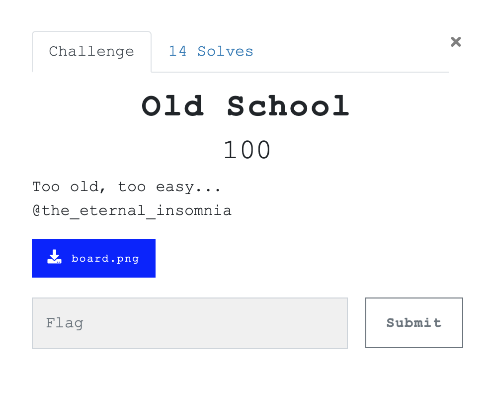
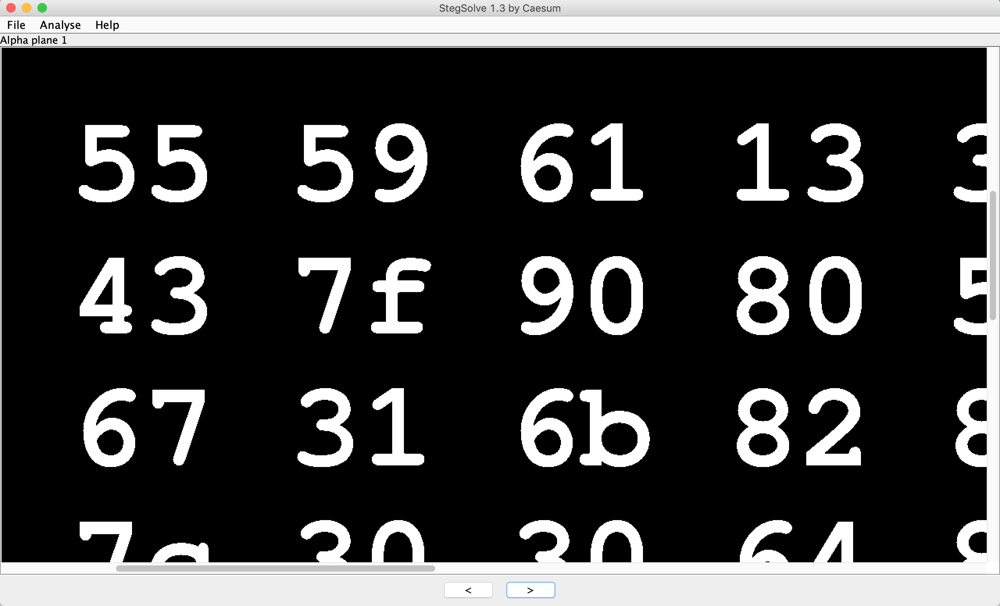
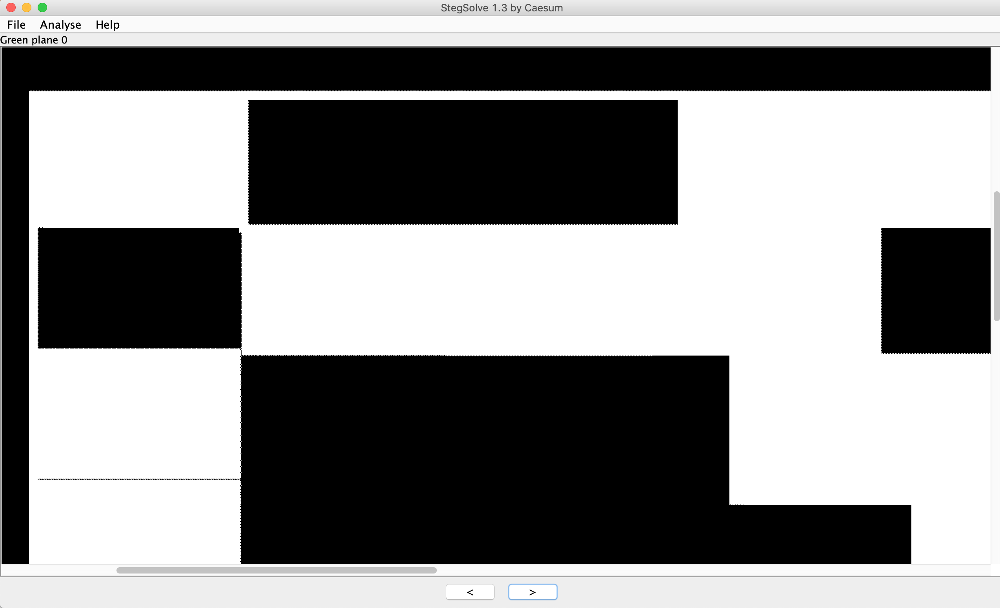
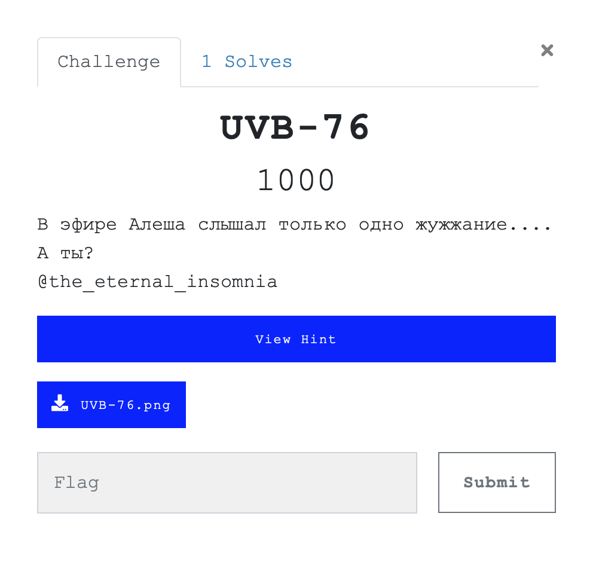
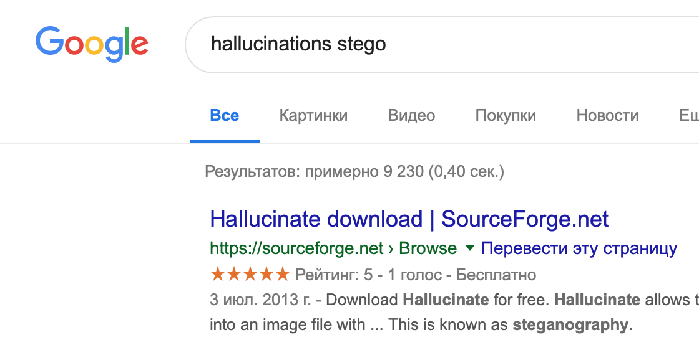
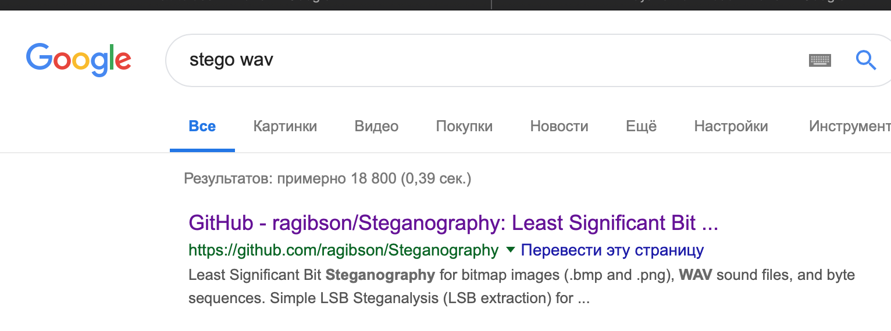

# Old school



[board.png](./src/board.png)

Имеем довольно таки обычное PNG изображение. Будем использовать джентльменский набор: exiftool, zsteg, binwalk, stegsolve.


```
$ exiftool board.png 
ExifTool Version Number         : 11.06
File Name                       : board.png
Directory                       : .
File Size                       : 21 MB
File Modification Date/Time     : 2019:05:04 16:21:35+03:00
File Access Date/Time           : 2019:05:13 00:29:30+03:00
File Inode Change Date/Time     : 2019:05:10 14:58:28+03:00
File Permissions                : rw-r--r--
File Type                       : PNG
File Type Extension             : png
MIME Type                       : image/png
Image Width                     : 3872
Image Height                    : 2592
Bit Depth                       : 8
Color Type                      : RGB with Alpha
Compression                     : Deflate/Inflate
Filter                          : Adaptive
Interlace                       : Noninterlaced
Image Size                      : 3872x2592
Megapixels                      : 10.0
```
Ничего интересного. Zsteg также неинформативен. 

```
$ binwalk board.png 

DECIMAL       HEXADECIMAL     DESCRIPTION
--------------------------------------------------------------------------------
0             0x0             PNG image, 3872 x 2592, 8-bit/color RGBA, non-interlaced
41            0x29            Zlib compressed data, default compression
928005        0xE2905         MySQL MISAM index file Version 10
```

Тут выявился забавный артефакт. Иногда binwalk в "обычных" данных встречает знакомые байты сигнатуры и принимает их за файл. Такое случается довольно редко, но все же случается. Можно было заэкстактить файлик и понять, что там кусок PNG.  

Итак, StegSolve. Да, боль. Да, большая картинка. Однако:




Честно говоря, даже не знаю, как можно было этого не заметить. В итоге получаем два файла: [solved1](./src/solved1.bmp) и [solved2](./src/solved2.bmp)

Перед нами обычный трафарет. Совмещаем и получаем флаг в hex. 


**Флаг:** `YauzaCTF{l1k3_600d_0ld_71m35}`

# UVB-76



[UVB-76.png](./src/uvb.png)

Из классики нам будут интересны следующие моменты:

```
$ exiftool UVB-76.png 
ExifTool Version Number         : 11.06
File Name                       : UVB-76.png
Directory                       : .
File Size                       : 45 MB
File Modification Date/Time     : 2019:05:04 01:47:39+03:00
File Access Date/Time           : 2019:05:10 14:57:00+03:00
File Inode Change Date/Time     : 2019:05:10 14:56:57+03:00
File Permissions                : rw-r--r--
File Type                       : PNG
File Type Extension             : png
MIME Type                       : image/png
Image Width                     : 4000
Image Height                    : 6000
Bit Depth                       : 8
Color Type                      : RGB
Compression                     : Deflate/Inflate
Filter                          : Adaptive
Interlace                       : Noninterlaced
Exif Byte Order                 : Big-endian (Motorola, MM)
Resolution Unit                 : inches
Y Cb Cr Positioning             : Centered
Exif Version                    : 0231
Components Configuration        : Y, Cb, Cr, -
User Comment                    : Have you seen SUB yet? It's just hallucinations.
Flashpix Version                : 0100
Owner Name                      : Rayane Hammoud
Image Size                      : 4000x6000
Megapixels                      : 24.0
```

**Have you seen SUB yet? It's just hallucinations.**

Что ж, пойдем смотреть SUB, только сперва найдем оригинал изображения. Для этого тут заботливо указан автор. Погуглив его, останавливаемся на <a href="https://unsplash.com/@canonloverop">третьей ссылке.</a> SUB же выглядит примерно так: 


Особо внимательные и опытные должны были распознать намек на утилиту Hallucinate. Как простым смертным до этого дойти? Вы удивитесь, но:



Результатом работы этой утилиты становится файл [buzzer.wav](./src/buzzer.wav)

Можно по разному поиграться с этой записью. Рано или поздно должна придти мысль об LSB, хотя бы поэтому:



Берем <a href="https://github.com/ragibson/Steganography">эту</a> или любую другую утилиту и получаем флаг. 

```
python3 WavSteg.py -r -s buzzer.wav -o flag.txt -n 1 -b 100
```

[flag.txt](./src/flag.txt)

**Флаг:** `YauzaCTF{ju57_7h3_buzz3r_v01c3_1n_7h3_n0153}`