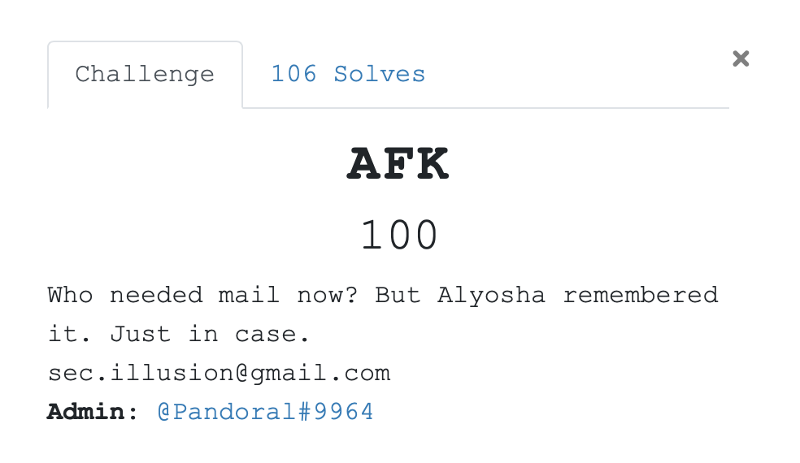
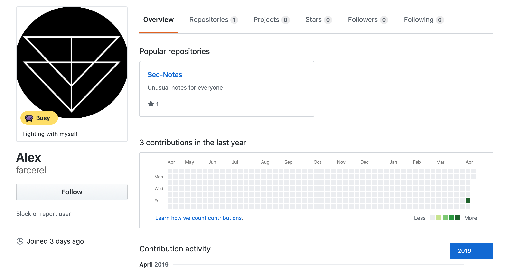
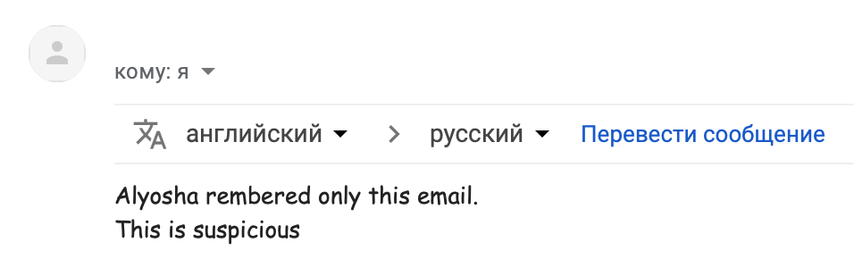
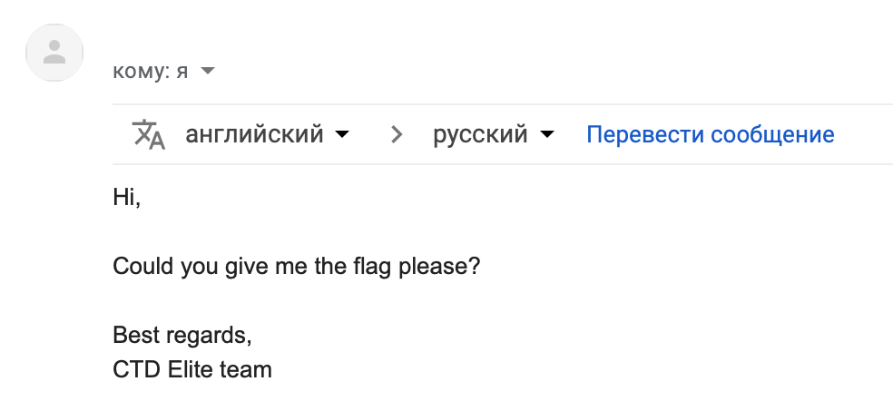
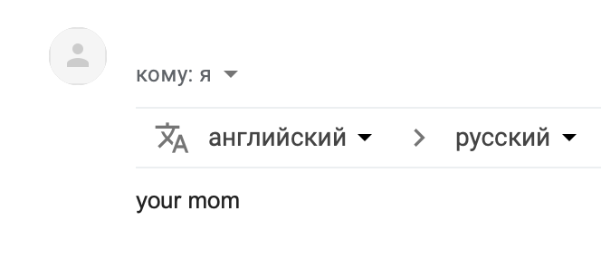
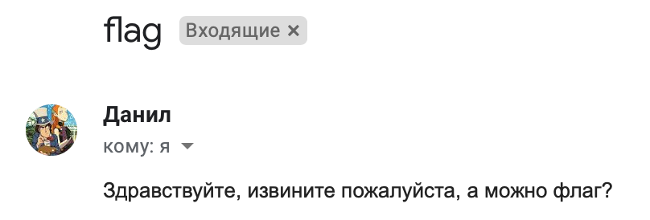
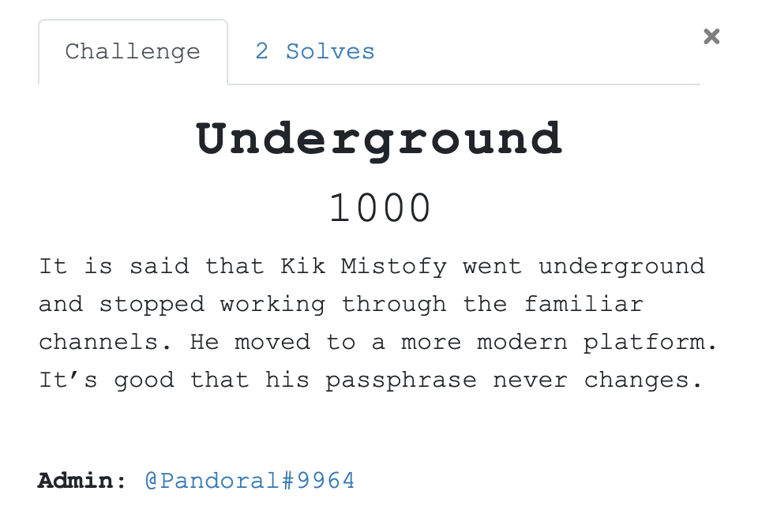

# AFK 



Начнем, пожалуй, с одного из самых легких заданий из категории Recon, да и из всего CTF.

    Кому нужна сейчас почта? Но Алеша помнил ее. На всякий случай. 

    sec.illusion@gmail.com

Что там первое приходит в голову? Если вы социофоб, то поколеблетесь пару минут, прогуглите почту (в гугле ничего интерсного, к слову не будет) и напишите на этот ящик. Если нет, то напишите сразу. 


Получаем автореплай с ссылкой на GitHub.
Часто в автореплаях содержится куча полезной инфы. Особенно в рабочих почтах. 



Гитхаб довольно скудный, даже негде разгуляться. Заходим в единственный репозиторий `Sec-Notes` с единственным файлом `important_bytes.bin`.

**Флаг:** `YauzaCTF{4u70r3ply_v3ry_u53ful}`

#### Из забавного 

Очень-очень много попыток сбросить пароль от аккаунтов. Зачем?



Действительно.



По канону. Красиво. Мне нравится. Лайк.



А вот это грубо. 


Ну и как не отдать флаг подоконнику? Вообще у цтферов бурная фантазия на названия. 


Разбитое стекло ¯\\_(ツ)_/¯


Not bad.


Состояние участников YauzaCTF: Даниил



Данил, извиняем и идем дальше по нарастающей.

# Career fair


[price.pdf](./src/price.pdf)

    Алеша расстерянно смотрел на кусочек бумаги. Ему нужен был тот контакт, который уничтожила Яуза. Но без следа ли? Этот контакт был бы очень полезен для него сейчас.

Открываем пдфку. Выделяем нужное место. Радуемся. На маке так и вообще эти штуки можно подвинуть. Удобно. 


Так же много интеерсной инфы в метаднных. Открываем PDFCandy.


В первую очередь нас должен интересовать UID ICQ. Расчехляем старого друга. 


**Флаг:** `YauzaCTF{w3_4r3_w47ch1n6_y0u}`

#### Из забавного


О - отчаяние.


Чувак, это не так работает.


Это угроза?

# I've seen you somewhere before.

Пошла жара. 


    В последний раз в тот день его видели здесь. Связной прислал нам это фото и исчез. А потом случилось то, что случилось. Нам нужны его аккаунты. Говорят, это что-то важное для всех нас.

[photo_11_04_19.png](./src/photo_11_04_19.png)

Первая важная вещь, которую необходимо выделить, -- дата. Часто названия файлов наследуются от ссылки, по которой они были скачаны. Там могут хранится айдишники, даты и все такое. Вам это здесь никак не пригодится, но просто запомните.

Итак, дата. 11.04.19. Идем дальше. Москвичи могут узнать Красный октябрь на фотографии, немосквичи и гости столицы могут подсунуть фотографию гуглу. 


Жмякнем в карты. Там будет куча всего ненужного. Отберем по фотография наш объект. Примерные координаты: `55.740400, 37.609830`


Суммируем.

1. Дата: `11.04.19`
2. Координаты: `55.740400, 37.609830`
3. Необходимо найти аккаунты. 

Минутка гугления и находим несколько нужных утилит.

- snradar.azurewebsites.net

- geocreepy.com

- photo-map.ru

Для любителей пожёстче: 

```
"https://api.vk.com/method/photos.search?"
        + "lat=" + location_latitude
        + "&long=" + location_longitude
        + "&count=" + 100
        + "&radius=" + distance
        + "&start_time=" + timestamp
        + "&end_time=" + (timestamp + date_increment)
```

Самый простой вариант из выше перечисленных -- SnRadar.


6 результат:


**Флаг:** `YauzaCTF{my_f4v0ur173_630_7465}`

#### Обход сложного решения. 

Решив AFK можно было сделать так:


Думаю, что можно обойтись без комментариев.

# Underground



    Говорят, что Kik Mistofy ушел в подполье и перестал работать по знакомым каналам. Он перешел на более современную платформу. Хорошо, что его пароль никогда не меняется.

Участники могли неверно интепретировать слово `passphrase` как пароль и пойти по неверному пути. Что ж, такое бывает. Но давайте по порядку.

Гугление по имени/нику ничего не даст. Нужно лишь вспомнить, что этот человек фигурировал в таске ранее. Рассмотрим пдфку внимательнее. Расценки нам ничего не дадут. В отличии от этого: 


Гуглим "анонимный фриланс". 


Помните никак не пригодившуюся ключевую фразу `blackwater`? Так вот, ошибкой решающих было то, что они искали нужное объявление в заданиях. Но у нас предложение различных услуг. 


**Флаг:** `YauzaCTF{4n0nym0u5_fr33l4nc3}`

<hr>

За сим откланяюсь и пойду делать таски на финал. Всем спасибо. Оставляйте фидбек и пишите свои решиния на знакомые вам каналы ;)

P.L.