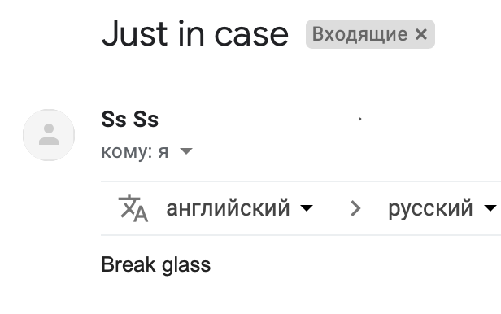

## AFK 

Начнем, пожалуй, с одного из самых легких заданий из категории Recon, да и из всего CTF.

    Кому нужна сейчас почта? Но Алеша помнил ее. На всякий случай. 

    sec.illusion@gmail.com

Что там первое приходит в голову? Если вы социофоб, то поколеблетесь пару минут, прогуглите почту (в гугле ничего интерсного, к слову не будет) и напишите на этот ящик. Если нет, то напишите сразу. 

Получаем автореплай с ссылкой на GitHub.
Часто в автореплаях содержится куча полезной инфы. Особенно в рабочих почтах. 

Гитхаб довольно скудный, даже негде разгуляться. Заходим в единственный репозиторий `Sec-Notes` с единственным файлом `important_bytes.bin`.

**Флаг:** `YauzaCTF{4u70r3ply_v3ry_u53ful}`

#### Из забавного 

Очень-очень много попыток сбросить пароль от аккаунтов. Зачем?

Действительно.

По канону. Красиво. Мне нравится. Лайк.

А вот это грубо. 

Ну и как не отдать флаг подоконнику? Вообще у цтферов бурная фантазия на названия. 

Разбитое стекло ¯\\_(ツ)_/¯

Not bad.

Состояние участников YauzaCTF: Даниил

Данил, извиняем и идем дальше по нарастающей. 

