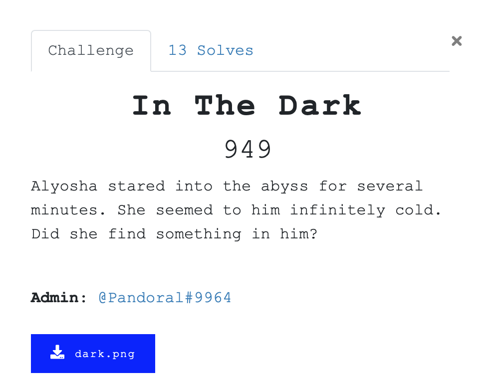
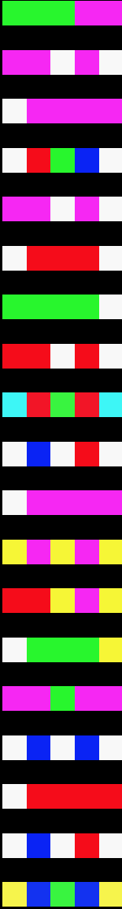
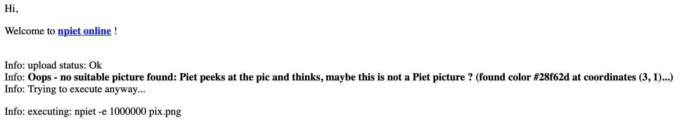
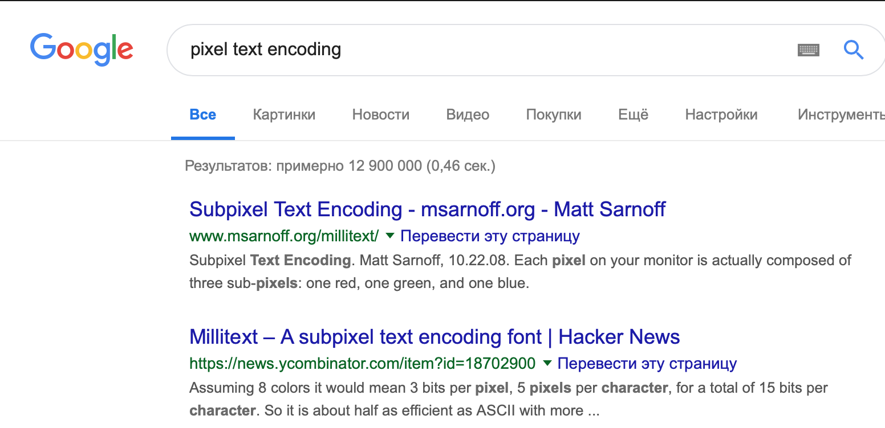
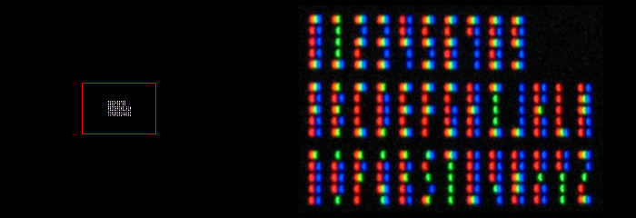
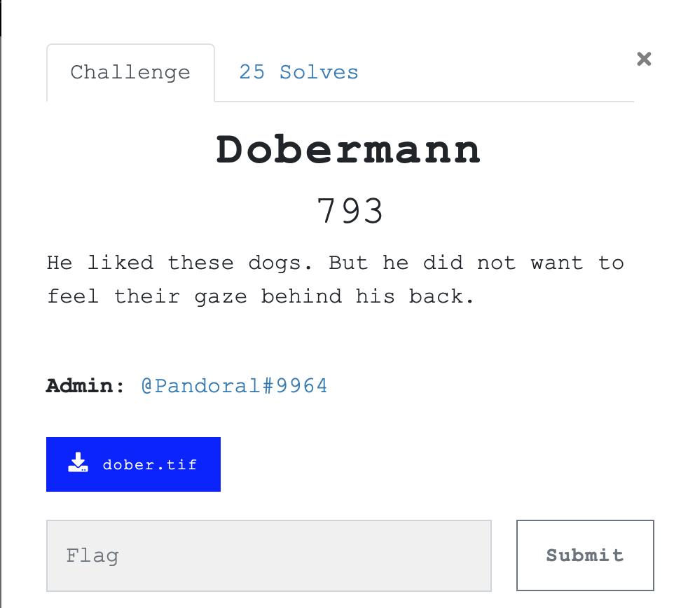
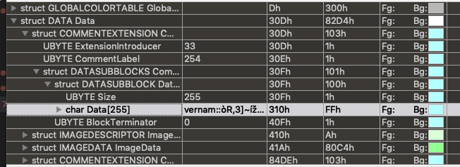

# In The Dark

    Алеша вглядывался в пустоту несколько минут. 
    Она казалась ему абсолютно холодной.
    Нашла ли она в нем что-то?

[dark.png](./src/dark.png)

На вход нам подается огромная картинка 7k x 5k абсолютно черного цвета. Но не нужно быть очень внимательным, чтобы заметить слева внизу странные помехи. 

Конечно же, в первую очередь exif и zsteg. Через Stegsolve тоже можно попробовать прогнать, но с таким размером изображения это полный ад. Binwalk так же ничего не даст.

    $ exiftool dark.png 
    ExifTool Version Number         : 11.06
    File Name                       : dark.png
    Directory                       : .
    File Size                       : 100 kB
    File Modification Date/Time     : 2019:03:12 01:39:42+03:00
    File Access Date/Time           : 2019:04:17 01:39:26+03:00
    File Inode Change Date/Time     : 2019:04:17 01:01:02+03:00
    File Permissions                : rw-r--r--
    File Type                       : PNG
    File Type Extension             : png
    MIME Type                       : image/png
    Image Width                     : 7000
    Image Height                    : 5000
    Bit Depth                       : 8
    Color Type                      : RGB
    Compression                     : Deflate/Inflate
    Filter                          : Adaptive
    Interlace                       : Noninterlaced
    Image Size                      : 7000x5000
    Megapixels                      : 35.0

В метаданных пустота :) 

    $ zsteg dark.png 
    [=] nothing :(   

Zsteg отчаялся уже на этом этапе.               

Неплохо проверить дейстительно ли картинка такая же черная, как нам кажется. 

    >>> from PIL import Image
    >>> dark = Image.open('dark.png')
    >>> dark.getcolors()
    [(24, (248, 248, 248)), (2, (10, 35, 244)), (12, (0, 248, 0)), (23, (248, 0, 246)), (6, (246, 248, 0)), (2, (245, 12, 26)), (2, (246, 246, 54)), (2, (43, 246, 247)), (2, (40, 246, 45)), (15, (248, 0, 0)), (5, (0, 0, 248)), (34999905, (0, 0, 0))]

Да, подавляющее большинство пикселей полностью черные, но есть незначительное количество шума. Невнимательные и не заметившие его в самом начале могли попробовать локализовать сгустки довольно ярких пикселей и получить левый нижний угол. Что ж, рассмотрим его подробнее.

Согласна, похоже то ли на Piet, то ли на Brainloller. И первый, и второй можно отбросить из-за использования "некруглых" значений цветов. Но лучше проверить, а то мало ли какой апдейт.

Brainloller можете проверить сами. 

Что же делать?
Давайте исходить из формата флага: `YauzaCTF{}`. Стоит отметить, что в нем есть две одинаковые буквы `а`. Есть ли у нас две одинаковые полоски?
Да, аж две пары: розовый-розовый-белый-розовый-белый и белей-розовыйX4 (дальтоники, извините). 
Но последняя пара на слишком большом расстоянии, а вот первая как раз на нужном. Отсюда можно сделать вывод, что перед нами флаг, где каждый символ -- это одна полоска пикселей. После сессии гуглинга можно придти к выводу, что это [субпиксельный шрифт](http://www.msarnoff.org/millitext/) или [3-пиксельные герои Футурамы](http://igirl.com.ua/2010/10/20/3-pikselnye-personazhi-futuramy-i-simpsonov/) (шутка, у нас высота в 5 пикселей).

 Алфавит у нас есть, осталось только закодить декодирование или сделать его руками. 

**Флаг:** `YauzaCTF{5UBP1X3L5}`/ `YAUZACTF{5UBP1X3L5}`

# Dobermann

    Он любил этих собак. Но он не хотел чувствововать их взгляд за спиной. 

[dober.tif](./src/dober.tif)

Как обычно, стандартная проверка: exiftool + binwalk. Zsteg и Stegsolve c форматом TIFF не работают. Strings использовать нет смысла. Пора бы уже это дело автоматизировать.

    $ exiftool dober.tif 
    ExifTool Version Number         : 11.06
    File Name                       : dober.tif
    Directory                       : .
    File Size                       : 434 kB
    File Modification Date/Time     : 2019:04:17 00:44:10+03:00
        File Access Date/Time           : 2019:04:17 14:33:59+03:00
    File Inode Change Date/Time     : 2019:04:17 01:00:00+03:00
    File Permissions                : rw-r--r--
    File Type                       : TIFF
    File Type Extension             : tif
    MIME Type                       : image/tiff
    Exif Byte Order                 : Little-endian (Intel, II)
    Image Width                     : 750
    Image Height                    : 854
    Bits Per Sample                 : 8
    Compression                     : LZW
    Photometric Interpretation      : RGB Palette
    Fill Order                      : Normal
    Document Name                   : D:\uploadedFiles\bb8a63979662e8e47cf447586ca848aa-e2d7b61d39ad4f6b\p1d7fm8qj41f6e1b8tnjc1r4g10494.tiff
    Strip Offsets                   : (Binary   data 573 bytes, use -b option to extract)
    Orientation                     : Horizontal (normal)
    Samples Per Pixel               : 1
    Rows Per Strip                  : 10
    Strip Byte Counts               : (Binary data 429 bytes, use -b option to extract)
    Planar Configuration            : Chunky
    Page Number                     : 0 1
    White Point                     : 0.3127000035 0.3289999963
    Primary Chromaticities          : 0.6399999858 0.3300000132 0.300000012 0.600000024 0.150000006 0.05999999867
    Color Map                       : (Binary data 1536 bytes, use -b option to extract)
    Image Size                      : 750x854
    Megapixels                      : 0.640

Тут может быть интересна строчка `Document Name`,но она была пустышкой.

    $ binwalk dober.tif 

    DECIMAL       HEXADECIMAL     DESCRIPTION
    --------------------------------------------------------------------------------
    0             0x0             TIFF image data, little-endian offset of first image directory: 407210
    409811        0x640D3         GIF image data, version "89a", 236 x 250

Оп, а вот это уже более интересно. Извлекаем гифку. По непонятной привычке я делаю это с помощью утилиты `dd`. 

    $ dd if=dober.tif of=dober.gif bs=1 skip=409811

Можем проделать все базовые штуки еще раз. Интересно будет только на этом моменте: 

    $ exiftool dober.gif
    ExifTool Version Number         : 11.06
    File Name                       : dober.gif
    Directory                       : .
    File Size                       : 33 kB
    File Modification Date/Time     : 2019:04:17 14:48:25+03:00
    File Access Date/Time           : 2019:04:17 14:49:43+03:00
    File Inode Change Date/Time     : 2019:04:17 14:49:32+03:00
    File Permissions                : rw-r--r--
    File Type                       : GIF
    File Type Extension             : gif
    MIME Type                       : image/gif
    GIF Version                     : 89a
    Image Width                     : 236
    Image Height                    : 250
    Has Color Map                   : Yes
    Color Resolution Depth          : 8
    Bits Per Pixel                  : 8
    Background Color                : 0
    Comment                         : vernam::?R?3]~?,?mr?]??qO?.?.27[.??N..??.c??.?K[wy.?.?$lx.?J?6?`*?%A???+ikX?fy!i?->????????b?b???7?>./'??QG.|?T?Yg??P)?-..?gJ#??.3, .?`?`/.?.3&?W?.?R6?.?r?V?H??.9)AnƘ?.??c.hn?h?p?9-i.?Bɹ?T?>?Υ..????E?ڟ??X?9???f)'!?W???..???ސ?{????@Y?|?F???F???9G
    Image Size                      : 236x250
    Megapixels                      : 0.059

Обратим внимание на поле `Comment`. Вернам? Один?"Он же абсолютно стойкий! Как мы будем его расшифровывать?" -- воскликнете вы. И будете правы. Нужен второй кусок. Грепнем строку `vernam` по изображению. 

    $ strings dober.gif | grep vernam
    vernam::
    vernam::

Вот он родимый кусочек. Откроем редактор, который может парсить файлы по шаблону, к примеру, 010Editor или Synalyze it, с нужным шаблоном  [89a спецификации](http://r-t-f-m.info/_books/15001/index.php#sect24). Видим две структуры комментария:

    >>> dober = open("dober.gif", "rb")
    >>> bytes = dober.read()
    >>> first = bytes[int("0x310", 0):int("0x310", 0)+int("0xFF", 0)]
    >>> first
    b"vernam::\xf2R\x823]~\xed\x9e,\xacmr\xad]\xaa\xe8qO\xcf\x17\x95\x1527[\x18\x8c\xcdN\x18\x1b\x90\xfd\x00.c\xe0\x83\x10\xfeK[wy\n\xd4\x17\x97$lx\t\x9aJ\xef6\xb6`*\xf8%A\x92\xed\xc7+ikX\xbbfy!i\xdf->\x9a\xa5\xc7\xef\xdc\xf6\xbf\xf6b\xcfb\xbc\xfe\xd37\xca>\x1b/'\xce\xc2QG\x17|\xb5T\xfcYg\xb6\xd7P)\xda-\x17\x17\xb1gJ#\xf6\xc0\x183, \x18\xb9`\x8b`/\x11\x8f\x0e3&\xd4W\xd5.\x81R6\x91\x06\x83r\xa8V\xe1\x91H\xa0\xcd\x159)An\xc6\x98\xd7\x05\x8e\xeec\x14hn\xc4h\xc7p\xc89-i\x0f\x93B\xc9\xb9\xd5T\xbc>?\xce\xa5\x18.\xfb\xdd\xe6\x91\xd1E\xbe\xda\x9f\xa0\xb0X\xcf9\xb1\xe9\xe0f)'!\x96W\x87\xb8\xd6\x10\x0f\x93\x81\xaf\xde\x90\x86{\xa9\xb5\x94\xee@Y\x86|\xb9F\xb8\xbb\xd3F\x9f\xe5\x9d\xfc9G"
    >>> second =  bytes[int("0x84E1", 0):int("0x84E1", 0)+int("0xFF", 0)]
    >>> second
    b"vernam::\xab\x13\xd7i\x1c=\xb9\xd8W\x9d\x03-\x98-\x99\x8b.8\xfcH\xa2gG\x02le\x86\xcdN\x18\x1b\x90\xfd\x00.c\xe0\x83\x10\xfeK[wy\n\xd4\x17\x97$lx\t\x9aJ\xef6\xb6`*\xf8%A\x92\xed\xc7+ikX\xbbfy!i\xdf->\x9a\xa5\xc7\xef\xdc\xf6\xbf\xf6b\xcfb\xbc\xfe\xd37\xca>\x1b/'\xce\xc2QG\x17|\xb5T\xfcYg\xb6\xd7P)\xda-\x17\x17\xb1gJ#\xf6\xc0\x183, \x18\xb9`\x8b`/\x11\x8f\x0e3&\xd4W\xd5.\x81R6\x91\x06\x83r\xa8V\xe1\x91H\xa0\xcd\x159)An\xc6\x98\xd7\x05\x8e\xeec\x14hn\xc4h\xc7p\xc89-i\x0f\x93B\xc9\xb9\xd5T\xbc>?\xce\xa5\x18.\xfb\xdd\xe6\x91\xd1E\xbe\xda\x9f\xa0\xb0X\xcf9\xb1\xe9\xe0f)'!\x96W\x87\xb8\xd6\x10\x0f\x93\x81\xaf\xde\x90\x86{\xa9\xb5\x94\xee@Y\x86|\xb9F\xb8\xbb\xd3F\x9f\xe5\x9d\xfc9G"
    >>> first = first.replace(b"vernam::", b'')
    >>> second = second.replace(b"vernam::", b'')
    >>> first = int.from_bytes(first, "big")
    >>> second = int.from_bytes(second, "big")
    >>> flag = first ^ second
    >>> flag = flag.to_bytes(flag.bit_length(), "big").strip(b"\x00")
    >>> flag
    b'YAUZACTF{1n_5p3c_w3_7ru57}\n' 

**Флаг:** `YAUZACTF{1n_5p3c_w3_7ru57}`

