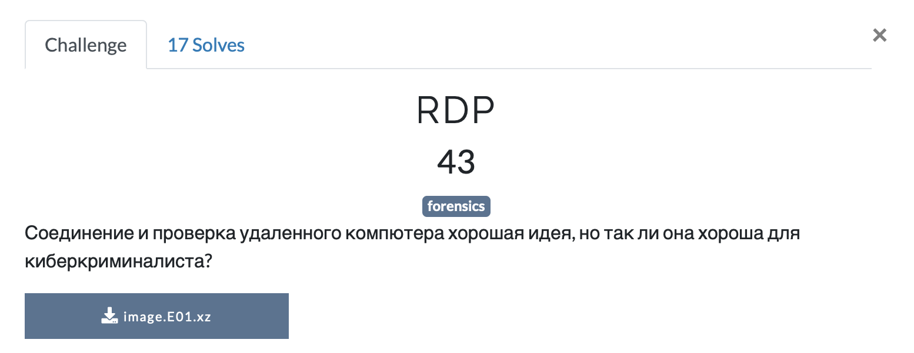
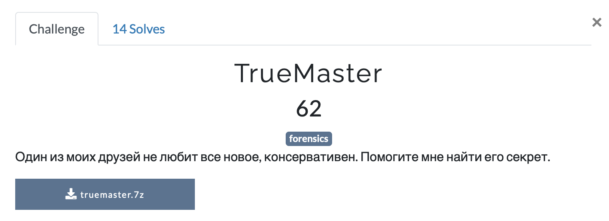
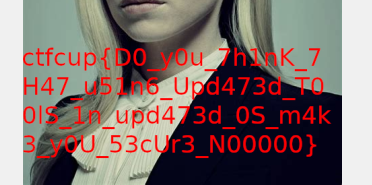
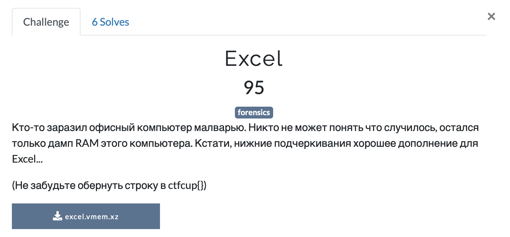

## RDP 



[image.E01](./src/image.E01)

Перед нами сжатый дамп диска в формате EnCase. Открываем черее FTK Imager и имеем следующую структуру: 


В root расположенен только один файл [cache](.src/cache). Дампим его. 

Исходя из названия, делаем вывод, что это RDP Bitmap cache. 

Для извлечения картинки используем тулзу [bmc-tools](https://github.com/ANSSI-FR/bmc-tools). 

```
$ python2 bmc-tools.py -s cache -d ./output -b
[+++] Processing a single file: 'cache'.
[===] 246 tiles successfully extracted in the end.
[===] Successfully exported 246 files.
```


Получем 246 склееных кусочков картинки. Склеить их довольно трудно из-за специфики передачи изображения в RDP. Примерное изображение:


**Флаг:** `сtfcup{d0_N07_U53_rDp_c4cH1n6_pLz_nO}`

## TrueMaster



На этот раз имеем [дамп памяти](./src/truemaster/memory.vmem.zip) и [файл](./src/truemaster/music) `music`.
Поиграемся с volatility. 

```
$ vol.py -f truemaster/memory.vmem imageinfo                                   [21:46:13]1 ↵
Volatility Foundation Volatility Framework 2.6.1
INFO    : volatility.debug    : Determining profile based on KDBG search...
          Suggested Profile(s) : WinXPSP2x86, WinXPSP3x86 (Instantiated with WinXPSP2x86)
                     AS Layer1 : IA32PagedMemoryPae (Kernel AS)
                     AS Layer2 : FileAddressSpace (/Users/pandas/Documents/Writeups/Кубок Кубков Quals 2020/Forensics/src/truemaster/memory.vmem)
                      PAE type : PAE
                           DTB : 0xb2a000L
                          KDBG : 0x80545ae0L
          Number of Processors : 1
     Image Type (Service Pack) : 3
                KPCR for CPU 0 : 0xffdff000L
             KUSER_SHARED_DATA : 0xffdf0000L
           Image date and time : 2020-07-26 13:10:54 UTC+0000
     Image local date and time : 2020-07-26 18:10:54 +0500
```

```
$ vol.py -f truemaster/memory.vmem --profile=WinXPSP2x86 pstree                                         [21:46:57]
Volatility Foundation Volatility Framework 2.6.1
Name                                                  Pid   PPid   Thds   Hnds Time
-------------------------------------------------- ------ ------ ------ ------ ----
 0x821c8830:System                                      4      0     62    246 1970-01-01 00:00:00 UTC+0000
. 0x81fe4a30:smss.exe                                 372      4      3     19 2020-07-26 13:09:02 UTC+0000
.. 0x81c9f228:winlogon.exe                            628    372     25    465 2020-07-26 13:09:04 UTC+0000
... 0x81d7bda0:services.exe                           672    628     16    272 2020-07-26 13:09:04 UTC+0000
.... 0x81c20b58:spoolsv.exe                          1664    672     15    132 2020-07-26 13:09:11 UTC+0000
.... 0x81f822a0:svchost.exe                           900    672     21    202 2020-07-26 13:09:05 UTC+0000
..... 0x81cab020:wmiprvse.exe                        1040    900     14    246 2020-07-26 13:09:38 UTC+0000
.... 0x81f64340:svchost.exe                          2000    672      5     86 2020-07-26 13:09:28 UTC+0000
.... 0x81d5cda0:vmtoolsd.exe                          444    672      9    260 2020-07-26 13:09:36 UTC+0000
.... 0x81dd4d08:svchost.exe                           960    672     10    241 2020-07-26 13:09:05 UTC+0000
.... 0x81e145d0:mscorsvw.exe                         2016    672      3     49 2020-07-26 13:09:28 UTC+0000
.... 0x81c8fa70:svchost.exe                          1104    672     67   1173 2020-07-26 13:09:06 UTC+0000
..... 0x81e97ae8:wuauclt.exe                         1756   1104      8    173 2020-07-26 13:10:22 UTC+0000
..... 0x81d30da0:wscntfy.exe                         1076   1104      1     35 2020-07-26 13:09:38 UTC+0000
.... 0x818ee208:alg.exe                              1240    672      7    104 2020-07-26 13:09:39 UTC+0000
.... 0x81ca99b0:vmacthlp.exe                          868    672      1     25 2020-07-26 13:09:05 UTC+0000
.... 0x81e38458:VGAuthService.e                       224    672      2     60 2020-07-26 13:09:28 UTC+0000
.... 0x81f68960:svchost.exe                          1252    672     15    199 2020-07-26 13:09:09 UTC+0000
.... 0x81f68020:svchost.exe                          1148    672      5     68 2020-07-26 13:09:06 UTC+0000
... 0x81dd8a10:lsass.exe                              684    628     27    362 2020-07-26 13:09:04 UTC+0000
.. 0x81e1b388:csrss.exe                               604    372      9    399 2020-07-26 13:09:04 UTC+0000
 0x81d44da0:explorer.exe                             1560   1500     17    459 2020-07-26 13:09:11 UTC+0000
. 0x81da5020:ctfmon.exe                              1428   1560      1     69 2020-07-26 13:09:39 UTC+0000
. 0x81da4648:TrueCrypt.exe                           1848   1560      2    124 2020-07-26 13:09:48 UTC+0000
. 0x81d33020:rundll32.exe                            1360   1560      4     67 2020-07-26 13:09:39 UTC+0000
. 0x81f54220:vmtoolsd.exe                            1376   1560      7    145 2020-07-26 13:09:39 UTC+0000
```

Если TrueCrypt запущен, то возможно в памяти остался master key и passphrase.

```
$ vol.py -f truemaster/memory.vmem  --profile=WinXPSP2x86 truecryptmaster -D .                                                                                                                                              [21:49:18]
Volatility Foundation Volatility Framework 2.6.1
Container: \??\C:\Documents and Settings\?????????????\??????? ????\music
Hidden Volume: No
Removable: No
Read Only: No
Disk Length: 66846720 (bytes)
Host Length: 67108864 (bytes)
Encryption Algorithm: AES
Mode: XTS
Master Key
0x81bfe1a8  24 79 f3 12 b6 8e 32 32 dc 1c 8e dc 96 b3 61 4b   $y....22......aK
0x81bfe1b8  57 0a 8b 82 6f 9b 2f bc 68 30 af 4c e4 02 f8 0d   W...o./.h0.L....
0x81bfe1c8  e0 a6 f2 77 d6 0c 1d 0b bf d0 67 5b a3 fc fd 57   ...w......g[...W
0x81bfe1d8  7e d9 ea b9 3a 22 31 aa 98 4f 34 37 8f 7a 43 a6   ~...:"1..O47.zC.
Dumped 64 bytes to ./0x81bfe1a8_master.key
```

Сдапмленный master key: [0x81bfe1a8_master.key](./src/0x81bfe1a8_master.key)

```
vol.py -f truemaster/memory.vmem --profile=WinXPSP2x86 clipboard -v                                                                                                                                [21:55:23]
Volatility Foundation Volatility Framework 2.6.1
Session    WindowStation Format                 Handle Object     Data                                              
---------- ------------- ------------------ ---------- ---------- --------------------------------------------------
         0 WinSta0       0xc009L               0xf0119 0xe24c7870                                                   
0xe24c787c  0c 01 03 00                                       ....
         0 WinSta0       CF_UNICODETEXT       0x1000cf 0xe1432a48 mNXsw57eIIJbEZbYqR8Qt0kG...UsvACVL/bAjo2fJ+QaxXg==
0xe1432a54  6d 00 4e 00 58 00 73 00 77 00 35 00 37 00 65 00   m.N.X.s.w.5.7.e.
0xe1432a64  49 00 49 00 4a 00 62 00 45 00 5a 00 62 00 59 00   I.I.J.b.E.Z.b.Y.
0xe1432a74  71 00 52 00 38 00 51 00 74 00 30 00 6b 00 47 00   q.R.8.Q.t.0.k.G.
0xe1432a84  32 00 34 00 67 00 69 00 4e 00 72 00 55 00 63 00   2.4.g.i.N.r.U.c.
0xe1432a94  65 00 59 00 33 00 67 00 4f 00 58 00 49 00 67 00   e.Y.3.g.O.X.I.g.
0xe1432aa4  62 00 6a 00 34 00 61 00 53 00 38 00 31 00 49 00   b.j.4.a.S.8.1.I.
0xe1432ab4  2f 00 53 00 59 00 2b 00 37 00 6b 00 47 00 75 00   /.S.Y.+.7.k.G.u.
0xe1432ac4  44 00 6e 00 55 00 4f 00 69 00 4f 00 41 00 58 00   D.n.U.O.i.O.A.X.
0xe1432ad4  4c 00 55 00 73 00 76 00 41 00 43 00 56 00 4c 00   L.U.s.v.A.C.V.L.
0xe1432ae4  2f 00 62 00 41 00 6a 00 6f 00 32 00 66 00 4a 00   /.b.A.j.o.2.f.J.
0xe1432af4  2b 00 51 00 61 00 78 00 58 00 67 00 3d 00 3d 00   +.Q.a.x.X.g.=.=.
0xe1432b04  00 00                                             ..
         0 WinSta0       0xc013L              0x130117 0xe252cf78                                                   
0xe252cf84  00 00 00 00 78 00 00 00 01 00 00 00 01 00 00 00   ....x...........
0xe252cf94  00 00 00 00 00 00 00 00 0d 00 ff ff 00 00 00 00   ................
0xe252cfa4  01 00 00 00 ff ff ff ff 01 00 00 00 01 00 00 00   ................
0xe252cfb4  00 00 00 00 00 00 00 00 00 00 00 00 00 00 00 00   ................
0xe252cfc4  00 00 00 00 00 00 00 00 00 00 00 00 00 00 00 00   ................
0xe252cfd4  00 00 00 00 00 00 00 00 00 00 00 00 00 00 00 00   ................
0xe252cfe4  00 00 00 00 00 00 00 00 00 00 00 00 00 00 00 00   ................
0xe252cff4  00 00 00 00 00 00 00 00                           ........
         0 WinSta0       CF_LOCALE            0x110113 0xe24f2aa0                                                   
0xe24f2aac  19 04 00 00                                       ....
         0 WinSta0       CF_TEXT                   0x1 ----------                                                   
         0 WinSta0       CF_OEMTEXT                0x1 ---------- 
```

Данные из буфера обмена: `mNXsw57eIIJbEZbYqR8Qt0kG24giNrUceY3gOXIgbj4aS81I/SY+7kGuDnUOiOAXLUsvACVL+QaxXg==`.

Попробуем примонтировать `music` с помощью master key чере утилиту [MKDecrypt](https://github.com/AmNe5iA/MKDecrypt).

```
$ python MKDecrypt.py truemaster/music -m /mnt/ -X 0x81bfe1a8_master.key
```

В примонтированном контейнере находим [file](./src/file.kdbx). Это файл Keepass  2.x.
Открываем базу с помощью ключа из буфера обмена. Находим в ней картинку.




**Флаг:** `ctfcup{D0_y0u_7h1nk_7H47_u51n6_Upd473d_T00lS_1n_upd473d_0S_m4k3_y0U_53cUr3_N00000}`

## Excel 



 pstree -> handlers excel -> dump book.xlsm -> VBA Stomping 

**Флаг:** `ctfcup{NOT_ALL_FUNCTIONS_OF_THE_OFFICE_SUITE_SHOULD_BE_USED_IN_A_CORPORATE_ENVIRONMENT_JUST_TRUST_ME_FRIEND}`

## NPR 

Желтые точки -> deda -> concat serial number -> p or q in rsa -> d = modinv(e, phi_n) - > bytes.fromhex(hex(res)[2:])

**Флаг:** `ctfcup{W0rk1N6_1N_l4W_3nf0rC3m3N7_15_4lW4Y5_D4n63R0uSSS...}`