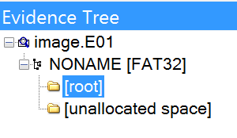

## RDP 


[image.E01](./src/image.E01)

Перед нами сжатый дамп диска в формате EnCase. Открываем черее FTK Imager и имеем следующую структуру: 



В root расположенен только один файл [cache](.src/cache). Дампим его. 

Исходя из названия, делаем вывод, что это RDP Bitmap cache. 

Для извлечения картинки используем тулзу [bmc-tools](https://github.com/ANSSI-FR/bmc-tools). 

```
$ python2 bmc-tools.py -s cache -d ./output -b
[+++] Processing a single file: 'cache'.
[===] 246 tiles successfully extracted in the end.
[===] Successfully exported 246 files.
```


Получем 246 кусочков картинки. Склеить их довольно трудно из-за специфики передачи изображения в RDP. Примерное изображение:


**Флаг:** `сtfcup{d0_N07_U53_rDp_c4cH1n6_pLz_nO}`

## TrueMaster


На этот раз имеем [дамп памяти](./src/truemaster/memory.vmem.zip) и [файл](./src/truemaster/music) `music`.
Поиграемся с volatility. 

```
$ vol.py -f truemaster/memory.vmem imageinfo                                   [21:46:13]1 ↵
Volatility Foundation Volatility Framework 2.6.1
INFO    : volatility.debug    : Determining profile based on KDBG search...
          Suggested Profile(s) : WinXPSP2x86, WinXPSP3x86 (Instantiated with WinXPSP2x86)
                     AS Layer1 : IA32PagedMemoryPae (Kernel AS)
                     AS Layer2 : FileAddressSpace (/Users/pandas/Documents/Writeups/Кубок Кубков Quals 2020/Forensics/src/truemaster/memory.vmem)
                      PAE type : PAE
                           DTB : 0xb2a000L
                          KDBG : 0x80545ae0L
          Number of Processors : 1
     Image Type (Service Pack) : 3
                KPCR for CPU 0 : 0xffdff000L
             KUSER_SHARED_DATA : 0xffdf0000L
           Image date and time : 2020-07-26 13:10:54 UTC+0000
     Image local date and time : 2020-07-26 18:10:54 +0500
```

```
$ vol.py -f truemaster/memory.vmem --profile=WinXPSP2x86 pstree                                         
Volatility Foundation Volatility Framework 2.6.1
Name                                                  Pid   PPid   Thds   Hnds Time
-------------------------------------------------- ------ ------ ------ ------ ----
 0x821c8830:System                                      4      0     62    246 1970-01-01 00:00:00 UTC+0000
. 0x81fe4a30:smss.exe                                 372      4      3     19 2020-07-26 13:09:02 UTC+0000
.. 0x81c9f228:winlogon.exe                            628    372     25    465 2020-07-26 13:09:04 UTC+0000
... 0x81d7bda0:services.exe                           672    628     16    272 2020-07-26 13:09:04 UTC+0000
.... 0x81c20b58:spoolsv.exe                          1664    672     15    132 2020-07-26 13:09:11 UTC+0000
.... 0x81f822a0:svchost.exe                           900    672     21    202 2020-07-26 13:09:05 UTC+0000
..... 0x81cab020:wmiprvse.exe                        1040    900     14    246 2020-07-26 13:09:38 UTC+0000
.... 0x81f64340:svchost.exe                          2000    672      5     86 2020-07-26 13:09:28 UTC+0000
.... 0x81d5cda0:vmtoolsd.exe                          444    672      9    260 2020-07-26 13:09:36 UTC+0000
.... 0x81dd4d08:svchost.exe                           960    672     10    241 2020-07-26 13:09:05 UTC+0000
.... 0x81e145d0:mscorsvw.exe                         2016    672      3     49 2020-07-26 13:09:28 UTC+0000
.... 0x81c8fa70:svchost.exe                          1104    672     67   1173 2020-07-26 13:09:06 UTC+0000
..... 0x81e97ae8:wuauclt.exe                         1756   1104      8    173 2020-07-26 13:10:22 UTC+0000
..... 0x81d30da0:wscntfy.exe                         1076   1104      1     35 2020-07-26 13:09:38 UTC+0000
.... 0x818ee208:alg.exe                              1240    672      7    104 2020-07-26 13:09:39 UTC+0000
.... 0x81ca99b0:vmacthlp.exe                          868    672      1     25 2020-07-26 13:09:05 UTC+0000
.... 0x81e38458:VGAuthService.e                       224    672      2     60 2020-07-26 13:09:28 UTC+0000
.... 0x81f68960:svchost.exe                          1252    672     15    199 2020-07-26 13:09:09 UTC+0000
.... 0x81f68020:svchost.exe                          1148    672      5     68 2020-07-26 13:09:06 UTC+0000
... 0x81dd8a10:lsass.exe                              684    628     27    362 2020-07-26 13:09:04 UTC+0000
.. 0x81e1b388:csrss.exe                               604    372      9    399 2020-07-26 13:09:04 UTC+0000
 0x81d44da0:explorer.exe                             1560   1500     17    459 2020-07-26 13:09:11 UTC+0000
. 0x81da5020:ctfmon.exe                              1428   1560      1     69 2020-07-26 13:09:39 UTC+0000
. 0x81da4648:TrueCrypt.exe                           1848   1560      2    124 2020-07-26 13:09:48 UTC+0000
. 0x81d33020:rundll32.exe                            1360   1560      4     67 2020-07-26 13:09:39 UTC+0000
. 0x81f54220:vmtoolsd.exe                            1376   1560      7    145 2020-07-26 13:09:39 UTC+0000
```

Если TrueCrypt запущен, то возможно в памяти остался master key и passphrase.

```
$ vol.py -f truemaster/memory.vmem  --profile=WinXPSP2x86 truecryptmaster -D .                                                                                                                                              [21:49:18]
Volatility Foundation Volatility Framework 2.6.1
Container: \??\C:\Documents and Settings\?????????????\??????? ????\music
Hidden Volume: No
Removable: No
Read Only: No
Disk Length: 66846720 (bytes)
Host Length: 67108864 (bytes)
Encryption Algorithm: AES
Mode: XTS
Master Key
0x81bfe1a8  24 79 f3 12 b6 8e 32 32 dc 1c 8e dc 96 b3 61 4b   $y....22......aK
0x81bfe1b8  57 0a 8b 82 6f 9b 2f bc 68 30 af 4c e4 02 f8 0d   W...o./.h0.L....
0x81bfe1c8  e0 a6 f2 77 d6 0c 1d 0b bf d0 67 5b a3 fc fd 57   ...w......g[...W
0x81bfe1d8  7e d9 ea b9 3a 22 31 aa 98 4f 34 37 8f 7a 43 a6   ~...:"1..O47.zC.
Dumped 64 bytes to ./0x81bfe1a8_master.key
```

Сдапмленный master key: [0x81bfe1a8_master.key](./src/0x81bfe1a8_master.key)

```
vol.py -f truemaster/memory.vmem --profile=WinXPSP2x86 clipboard -v                                                                                                                                [21:55:23]
Volatility Foundation Volatility Framework 2.6.1
Session    WindowStation Format                 Handle Object     Data                                              
---------- ------------- ------------------ ---------- ---------- --------------------------------------------------
         0 WinSta0       0xc009L               0xf0119 0xe24c7870                                                   
0xe24c787c  0c 01 03 00                                       ....
         0 WinSta0       CF_UNICODETEXT       0x1000cf 0xe1432a48 mNXsw57eIIJbEZbYqR8Qt0kG...UsvACVL/bAjo2fJ+QaxXg==
0xe1432a54  6d 00 4e 00 58 00 73 00 77 00 35 00 37 00 65 00   m.N.X.s.w.5.7.e.
0xe1432a64  49 00 49 00 4a 00 62 00 45 00 5a 00 62 00 59 00   I.I.J.b.E.Z.b.Y.
0xe1432a74  71 00 52 00 38 00 51 00 74 00 30 00 6b 00 47 00   q.R.8.Q.t.0.k.G.
0xe1432a84  32 00 34 00 67 00 69 00 4e 00 72 00 55 00 63 00   2.4.g.i.N.r.U.c.
0xe1432a94  65 00 59 00 33 00 67 00 4f 00 58 00 49 00 67 00   e.Y.3.g.O.X.I.g.
0xe1432aa4  62 00 6a 00 34 00 61 00 53 00 38 00 31 00 49 00   b.j.4.a.S.8.1.I.
0xe1432ab4  2f 00 53 00 59 00 2b 00 37 00 6b 00 47 00 75 00   /.S.Y.+.7.k.G.u.
0xe1432ac4  44 00 6e 00 55 00 4f 00 69 00 4f 00 41 00 58 00   D.n.U.O.i.O.A.X.
0xe1432ad4  4c 00 55 00 73 00 76 00 41 00 43 00 56 00 4c 00   L.U.s.v.A.C.V.L.
0xe1432ae4  2f 00 62 00 41 00 6a 00 6f 00 32 00 66 00 4a 00   /.b.A.j.o.2.f.J.
0xe1432af4  2b 00 51 00 61 00 78 00 58 00 67 00 3d 00 3d 00   +.Q.a.x.X.g.=.=.
0xe1432b04  00 00                                             ..
         0 WinSta0       0xc013L              0x130117 0xe252cf78                                                   
0xe252cf84  00 00 00 00 78 00 00 00 01 00 00 00 01 00 00 00   ....x...........
0xe252cf94  00 00 00 00 00 00 00 00 0d 00 ff ff 00 00 00 00   ................
0xe252cfa4  01 00 00 00 ff ff ff ff 01 00 00 00 01 00 00 00   ................
0xe252cfb4  00 00 00 00 00 00 00 00 00 00 00 00 00 00 00 00   ................
0xe252cfc4  00 00 00 00 00 00 00 00 00 00 00 00 00 00 00 00   ................
0xe252cfd4  00 00 00 00 00 00 00 00 00 00 00 00 00 00 00 00   ................
0xe252cfe4  00 00 00 00 00 00 00 00 00 00 00 00 00 00 00 00   ................
0xe252cff4  00 00 00 00 00 00 00 00                           ........
         0 WinSta0       CF_LOCALE            0x110113 0xe24f2aa0                                                   
0xe24f2aac  19 04 00 00                                       ....
         0 WinSta0       CF_TEXT                   0x1 ----------                                                   
         0 WinSta0       CF_OEMTEXT                0x1 ---------- 
```

Данные из буфера обмена: `mNXsw57eIIJbEZbYqR8Qt0kG24giNrUceY3gOXIgbj4aS81I/SY+7kGuDnUOiOAXLUsvACVL+QaxXg==`.

Попробуем примонтировать `music` с помощью master key через утилиту [MKDecrypt](https://github.com/AmNe5iA/MKDecrypt).

```
$ python MKDecrypt.py truemaster/music -m /mnt/ -X 0x81bfe1a8_master.key
```

В примонтированном контейнере находим [file](./src/file.kdbx). Это файл Keepass  2.x.
Открываем базу с помощью ключа из буфера обмена. Находим в ней картинку.


**Флаг:** `ctfcup{D0_y0u_7h1nk_7H47_u51n6_Upd473d_T00lS_1n_upd473d_0S_m4k3_y0U_53cUr3_N00000}`

## Excel 


Стандартно пройдемся по образу с volatility.

```
$ vol.py -f excel.vmem imageinfo                                 
Volatility Foundation Volatility Framework 2.6.1
INFO    : volatility.debug    : Determining profile based on KDBG search...

          Suggested Profile(s) : Win7SP1x64, Win7SP0x64, Win2008R2SP0x64, Win2008R2SP1x64_24000, Win2008R2SP1x64_23418, Win2008R2SP1x64, Win7SP1x64_24000, Win7SP1x64_23418
                     AS Layer1 : WindowsAMD64PagedMemory (Kernel AS)
                     AS Layer2 : FileAddressSpace (/Users/pandas/Desktop/Кубок/excel.vmem)
                      PAE type : No PAE
                           DTB : 0x187000L
                          KDBG : 0xf80002c550a0L
          Number of Processors : 1
     Image Type (Service Pack) : 1
                KPCR for CPU 0 : 0xfffff80002c56d00L
             KUSER_SHARED_DATA : 0xfffff78000000000L
           Image date and time : 2020-11-01 20:56:13 UTC+0000
     Image local date and time : 2020-11-01 23:56:13 +0300
```

```
$ vol.py -f excel.vmem --profile=Win7SP1x64 pstree               
Volatility Foundation Volatility Framework 2.6.1
Name                                                  Pid   PPid   Thds   Hnds Time
-------------------------------------------------- ------ ------ ------ ------ ----
 0xfffffa80038b2060:wininit.exe                       400    340      8     89 2020-11-01 20:55:36 UTC+0000
. 0xfffffa8003b7c410:lsass.exe                        512    400      9    538 2020-11-01 20:55:36 UTC+0000
. 0xfffffa8003b42700:lsm.exe                          520    400     10    160 2020-11-01 20:55:36 UTC+0000
. 0xfffffa8002e0d530:services.exe                     504    400     17    243 2020-11-01 20:55:36 UTC+0000
.. 0xfffffa8003ec15f0:dllhost.exe                    1964    504     18    205 2020-11-01 20:55:39 UTC+0000
.. 0xfffffa80039c2b30:svchost.exe                     984    504     19    394 2020-11-01 20:55:38 UTC+0000
.. 0xfffffa8003b5d060:taskhost.exe                   1304    504      9    155 2020-11-01 20:55:38 UTC+0000
.. 0xfffffa8003dd49d0:svchost.exe                     772    504     21    435 2020-11-01 20:55:37 UTC+0000
.. 0xfffffa80036e9540:svchost.exe                     932    504     45    808 2020-11-01 20:55:38 UTC+0000
.. 0xfffffa8003d52060:msdtc.exe                      1192    504     15    157 2020-11-01 20:55:40 UTC+0000
.. 0xfffffa8003b75b30:svchost.exe                    1324    504     24    328 2020-11-01 20:55:38 UTC+0000
.. 0xfffffa8003cd7060:vmtoolsd.exe                   1584    504     10    192 2020-11-01 20:55:39 UTC+0000
.. 0xfffffa8003d692d0:vm3dservice.ex                  696    504      4     46 2020-11-01 20:55:37 UTC+0000
.. 0xfffffa8003b2e9e0:spoolsv.exe                    1272    504     15    285 2020-11-01 20:55:38 UTC+0000
.. 0xfffffa8003d74b30:svchost.exe                     720    504     11    306 2020-11-01 20:55:37 UTC+0000
.. 0xfffffa8003e8eb30:dllhost.exe                    1892    504     20    190 2020-11-01 20:55:39 UTC+0000
.. 0xfffffa8002eb55c0:svchost.exe                     860    504     21    406 2020-11-01 20:55:37 UTC+0000
... 0xfffffa8003a2da10:dwm.exe                       1096    860      5     72 2020-11-01 20:55:38 UTC+0000
.. 0xfffffa80040e2060:OSPPSVC.EXE                    2256    504      5    132 2020-11-01 20:56:02 UTC+0000
.. 0xfffffa8003da5b30:VGAuthService.                 1552    504      4     84 2020-11-01 20:55:39 UTC+0000
.. 0xfffffa800395cb30:svchost.exe                     356    504     35    758 2020-11-01 20:55:38 UTC+0000
.. 0xfffffa80039b4250:SearchIndexer.                  968    504     13    694 2020-11-01 20:55:44 UTC+0000
... 0xfffffa8002fa8060:SearchProtocol                2792    968      8    278 2020-11-01 20:55:56 UTC+0000
... 0xfffffa8003f6eb30:SearchProtocol                2116    968      7    229 2020-11-01 20:55:44 UTC+0000
... 0xfffffa8003fb2630:SearchFilterHo                2136    968      5     85 2020-11-01 20:55:44 UTC+0000
.. 0xfffffa8002eb6b30:svchost.exe                    2216    504     30    335 2020-11-01 20:55:46 UTC+0000
.. 0xfffffa8004098240:WmiApSrv.exe                   3000    504      7    120 2020-11-01 20:56:00 UTC+0000
.. 0xfffffa8003d1a3e0:svchost.exe                     632    504     15    367 2020-11-01 20:55:37 UTC+0000
... 0xfffffa8003e81630:WmiPrvSE.exe                  1940    632      9    144 2020-11-01 20:55:39 UTC+0000
... 0xfffffa8003f85b30:WmiPrvSE.exe                  2892    632     13    315 2020-11-01 20:55:59 UTC+0000
.. 0xfffffa8002ef0b30:VSSVC.exe                      1956    504      6    121 2020-11-01 20:55:40 UTC+0000
.. 0xfffffa8004009b30:wmpnetwk.exe                   2344    504     14    226 2020-11-01 20:55:46 UTC+0000
 0xfffffa800371ab30:csrss.exe                         348    340      8    550 2020-11-01 20:55:35 UTC+0000
 0xfffffa80018ad840:System                              4      0     88    481 2020-11-01 20:55:35 UTC+0000
. 0xfffffa800c3f4620:smss.exe                         268      4      4     29 2020-11-01 20:55:35 UTC+0000
 0xfffffa80038a35f0:csrss.exe                         412    392      9    228 2020-11-01 20:55:36 UTC+0000
 0xfffffa8003a02870:winlogon.exe                      460    392      6    119 2020-11-01 20:55:36 UTC+0000
 0xfffffa8003a46b30:explorer.exe                     1112   1084     44    921 2020-11-01 20:55:38 UTC+0000
. 0xfffffa8003aea8e0:vm3dservice.ex                  1216   1112      5     50 2020-11-01 20:55:38 UTC+0000
. 0xfffffa8003a8a500:vmtoolsd.exe                    1224   1112      9    150 2020-11-01 20:55:38 UTC+0000
. 0xfffffa80040b76c0:EXCEL.EXE                       3052   1112     17    423 2020-11-01 20:56:01 UTC+0000
```

Комбинируем информацию из описания таска и вывода `pstree`: скорее всего малварь находится в макросах Excel.
Посмотрим в нем открытые файлы: 

```
$ vol.py -f excel.vmem --profile=Win7SP1x64 handles -p 3052 -t File  
Volatility Foundation Volatility Framework 2.6.1
Offset(V)             Pid             Handle             Access Type             Details
------------------ ------ ------------------ ------------------ ---------------- -------
0xfffffa8004073410   3052               0x10           0x100020 File             \Device\HarddiskVolume1\Windows\winsxs\amd64_microsoft.windows.gdiplus_6595b64144ccf1df_1.1.7601.17514_none_2b24536c71ed437a
0xfffffa8002faa330   3052              0x18c           0x100020 File             \Device\HarddiskVolume1\Windows\winsxs\amd64_microsoft.windows.common-controls_6595b64144ccf1df_6.0.7601.17514_none_fa396087175ac9ac
0xfffffa80040d38c0   3052              0x1a4           0x100020 File             \Device\HarddiskVolume1\Windows\winsxs\amd64_microsoft.windows.common-controls_6595b64144ccf1df_6.0.7601.17514_none_fa396087175ac9ac
0xfffffa80040d17b0   3052              0x1b8           0x100001 File             \Device\KsecDD
0xfffffa80040b81e0   3052              0x2b4           0x120089 File             \Device\HarddiskVolume1\Windows\Registration\R000000000006.clb
0xfffffa800410fcf0   3052              0x3a4           0x100020 File             \Device\HarddiskVolume1\Windows\winsxs\amd64_microsoft.windows.common-controls_6595b64144ccf1df_6.0.7601.17514_none_fa396087175ac9ac
0xfffffa800410f470   3052              0x3a8           0x120089 File             \Device\HarddiskVolume1\Windows\Fonts\StaticCache.dat
0xfffffa80040df720   3052              0x3f8           0x100020 File             \Device\HarddiskVolume1\Users\user\Documents
0xfffffa800411f680   3052              0x410           0x100020 File             \Device\HarddiskVolume1\Windows\winsxs\amd64_microsoft.windows.common-controls_6595b64144ccf1df_6.0.7601.17514_none_fa396087175ac9ac
0xfffffa80040e6520   3052              0x4d8           0x12019f File             \Device\HarddiskVolume1\Users\user\Desktop\book.xlsm
0xfffffa80040e6070   3052              0x4dc           0x13019f File             \Device\HarddiskVolume1\Users\user\Desktop\~$book.xlsm
0xfffffa80040e6240   3052              0x4fc           0x120089 File             \Device\HarddiskVolume1\Windows\System32\en-US\KernelBase.dll.mui
0xfffffa8004129e00   3052              0x578           0x100020 File             \Device\HarddiskVolume1\Windows\winsxs\amd64_microsoft.windows.common-controls_6595b64144ccf1df_6.0.7601.17514_none_fa396087175ac9ac
0xfffffa80042b7f20   3052              0x59c           0x12019f File             \Device\NamedPipe\srvsvc
```

Сдампим `book.xlsm`:

```
$ vol.py -f excel.vmem --profile=Win7SP1x64 dumpfiles -p 3052 --dump-dir=./extract/excel -n -r ".xlsm"                                                                                               
Volatility Foundation Volatility Framework 2.6.1
DataSectionObject 0xfffffa80040e6520   3052   \Device\HarddiskVolume1\Users\user\Desktop\book.xlsm
SharedCacheMap 0xfffffa80040e6520   3052   \Device\HarddiskVolume1\Users\user\Desktop\book.xlsm
DataSectionObject 0xfffffa80040e6070   3052   \Device\HarddiskVolume1\Users\user\Desktop\~$book.xlsm
```

Если открыть этот документ, то никаких макросов в нем не будет. Это навевает мысль о [VBA Stomping](https://medium.com/walmartglobaltech/vba-stomping-advanced-maldoc-techniques-612c484ab278). 

Извлечем код скрипта: 

```
$ python pcodedmp -o ./vba.txt ./extract/excel/file.3052.0xfffffa800407c360.book.xlsm.dat
```

Полный вывод команды можно посмотреть [тут](./src/vba.txt). 

Если присмотреться, то буквы в скрипте составляют флаг. 


**Флаг:** `ctfcup{NOT_ALL_FUNCTIONS_OF_THE_OFFICE_SUITE_SHOULD_BE_USED_IN_A_CORPORATE_ENVIRONMENT_JUST_TRUST_ME_FRIEND}`

## NPR 

> NSA, PDF, RSA... Как это все может быть связано?

[task](./src/task.pdf.zip)

Загружаем PDF-файл в peepdf.

```
python2 peepdf/peepdf.py -i task.pdf
```

После дательного разбора Pdf, начинаем пристально смотреть на сами страницы и замечаем это: 


https://ru.wikipedia.org/wiki/Жёлтые_точки

Чтобы проанализировать эти точки, нужно воспользоваться утилитой [Deda](https://github.com/dfd-tud/deda). Но она принимает только картинки (почему-то), поэтому [генерим](https://github.com/Belval/pdf2image) 170 картинок из PDF.

Далее отправляем их всем скопом к Deda и получаем примерно такой результат: 


Изменения присходят только в области серийного номера. Извлекаем (можно просто сохранить [главную страницу](./src/Deda_Toolkit.html)) и конкатенируем:

```python
import re
html = open("Deda Toolkit.html")
html = html.read()
no = re.findall(r"<th>Serial Number</th><td>-(\d+)-</td></tr><tr>", html)
res = "".join(no)
print(res)
```

```
132719327903514841803909235464003777694720061617155833522697358838296873557452906660136685718202435354483537072834386846594910759478332167517328247259660105423278733086442483956654930124409375464590779909007770850794068778156647312388260376240933163989113517314938409577364969609622183167547230786164122920218238209210976525332773591257576370392681671642209106283093763630215490526469746477659776621992766098971951132192715664406592894931084081494008714489746325131961572843940344788399046991811221616623716462095466046551171096506028922922689892799565281993751488074086176820968596060784506956149300689624744147341129427530436056225549703847680820789643362743740789270498713384615049248864527144776850192207931692963272256796926215037605159053910360213756029473959486906093559273085968187574189065449712066043643018718138534172270802248696332146044723935650798073461374010663501576469218443853334008803626068642382291063308963111958651813194154476310471100980480317343826378370968439369910604597307966929784043695703543
```

Теперь разбираемся в RSA. У нас есть: `c` (шифротекст), `e` (открытая экспонента), `n` (модуль). 

Можем предположить, что найденное число является секретной экспонентой `d`.

Проверяем: 

```python
from Crypto.PublicKey import RSA
c = 609633081964841501...472572305220265782632
e = 65537
n = 21461298315795389...1462879790903816437
d = 1327193279...43695703543

cipher = RSA.construct((n, e, d))
```

Получаем следующую ошибку: 

```python
Traceback (most recent call last):
  File "<stdin>", line 1, in <module>
  File "/Users/pandas/.virtualenvs/ctf/lib/python3.9/site-packages/Crypto/PublicKey/RSA.py", line 561, in construct
    raise ValueError("Unable to compute factors p and q from exponent d.")
ValueError: Unable to compute factors p and q from exponent d.
```

Это говорит о том, что текущее число не является секретной экспонентой. Остаются только факторы `n`. Вычисляем `d` и расшифровываем сообщение:

```python
def egcd(a, b):
    if a == 0:
        return (b, 0, 1)
    g, y, x = egcd(b%a,a)
    return (g, x - (b//a) * y, y)

def modinv(a, m):
    g, x, y = egcd(a, m)
    if g != 1:
        raise Exception('No modular inverse')
    return x%m

d = modinv(e, phi_n)
res = pow(c, d, n)
print(bytes.fromhex(hex(res)[2:]))
# b'ctfcup{W0rk1N6_1N_l4W_3nf0rC3m3N7_15_4lW4Y5_D4n63R0uSSS...}'
```

**Флаг:** `ctfcup{W0rk1N6_1N_l4W_3nf0rC3m3N7_15_4lW4Y5_D4n63R0uSSS...}`